# 第一章 机器学习简介

## 1. **什么是机器学习**

机器学习简单地说，就是把把人类学习的过程数学化、模型化。

下面这一张图生动地反映了传统编程和机器学习的区别：

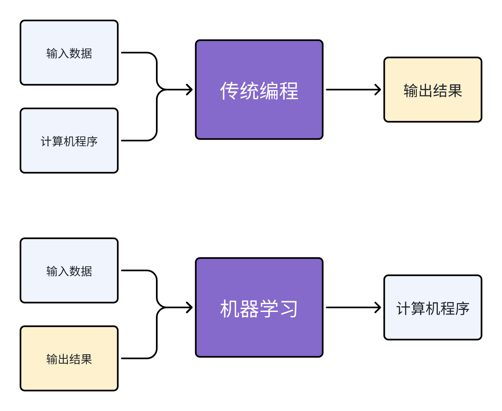

几乎所有的机器学习都包括以下三个部分：数据、模型和损失函数。

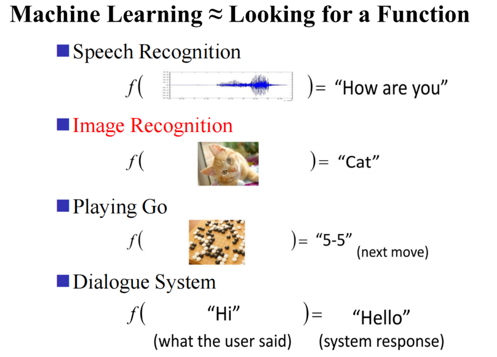

数据（Data）：不同的应用需要处理不同的数据。豆包 MarsCode AI 处理的数据以代码和自然语言为主

模型（Model）：我们需要根据实际情况训练出特定的模型，来应对特定的需求。

评估（Model Evaluation）：从日常生活的角度看，我们评价豆包 MarsCode AI （一款 AI 辅助刷题软件，网址 marscode.cn）的质量主要在于它自动生成代码的精准程度。但是“精准程度”对于计算机科学家来说是无法准确度量的，因此，科学家总结了众多模型，决定使用损失函数（loss function）来对模型进行统一的评价。损失主要包括三种：（铰链损失 Hinge Loss, 逻辑损失 Logistic Loss, 多分类损失 Softmax Loss）

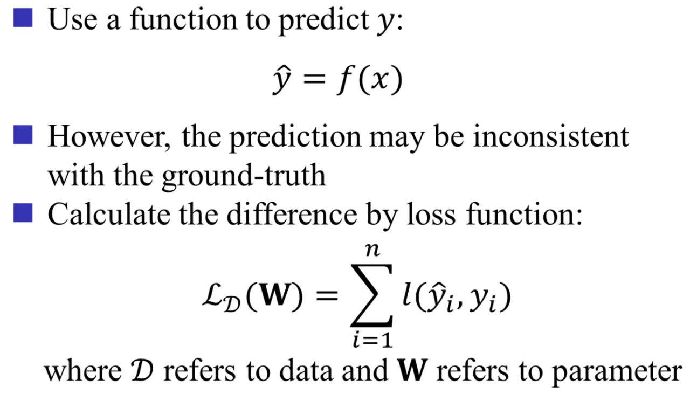

机器学习是一个综合性很强的科目，这一门学科融合的科目不下数十种，在此进行简单地列举：高等数学（数学分析）、线性代数（抽象代数）、概率论与数理统计、统计科学、数据挖掘、控制理论、决策理论、认知科学、心理学模型、基因科学、进化论模型、数据库、信息理论。

机器学习其实和一些哲学思想也紧密相关，以下是笔者的老师结合科研经验总结出来的导图：

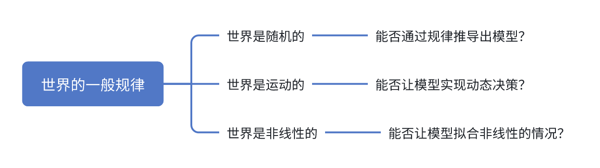

## 2. 机器学习的分类

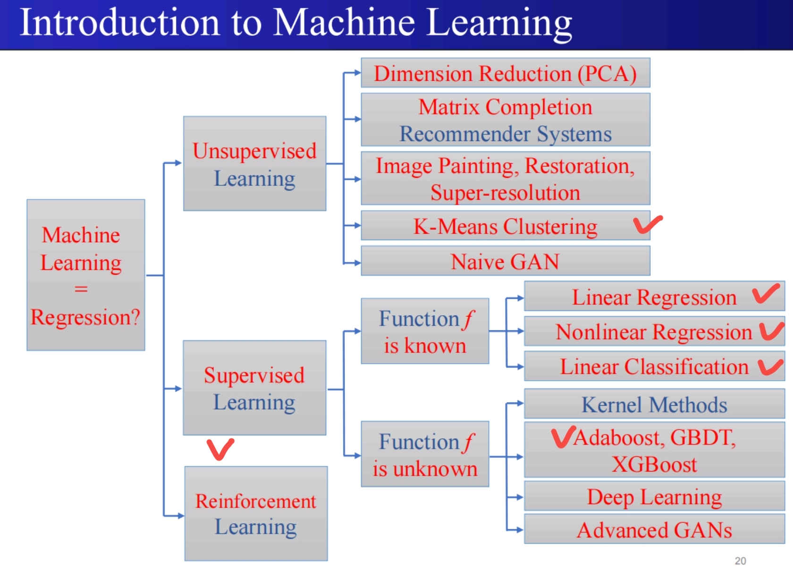

### (1) 有监督的学习（Supervised Learning）

如何理解有监督的学习？在现实生活中，人类幼崽是在父母和祖辈的监督下成长的。**在机器学习的领域中，有监督的学习就是从被标记的训练集合上训练模型或者函数。**

经典的使用案例：预测某个地区的房产价格、预测某一位同学的 GPA、判断图片是不是猫猫狗狗......

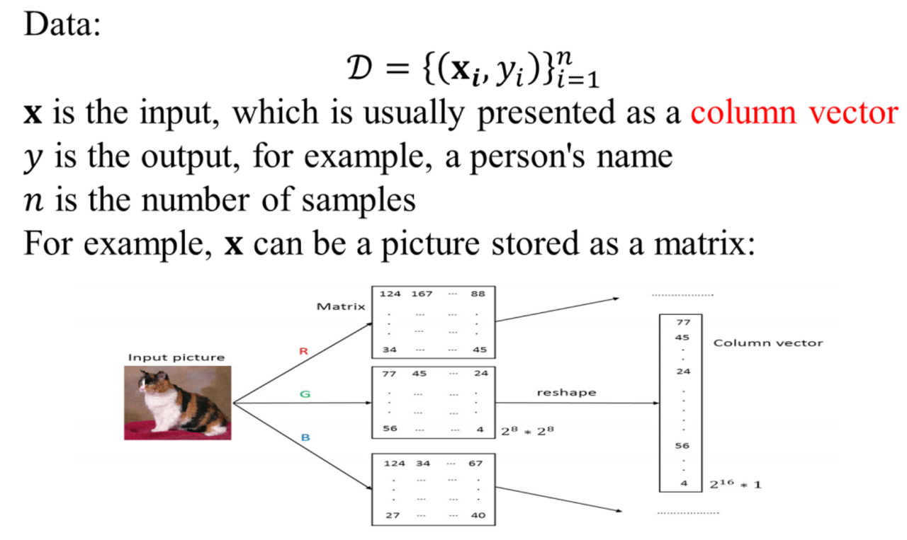

### (2) 无监督的学习（Unsupervised Learning）

如何理解无监督的学习？无监督的学习指的是去除掉特定的标志（labels），让模型自行学习不同训练集合的内在联系。在这种情况，模型通过对比来学习被隐藏的结构，就像是父母要我们向榜样学习一样。

经典的使用案例：K-Means Clustering（聚类算法）实现文档归类、图像分割......

### (3) 强化学习（Reinforcement Learning）

强化学习主要包括了Agent（助理）、环境、状态、行为和奖励五个部分，Agent的目的是在一段时间以内积累出最大化的累计奖励。在现实生活中，当父母生气时，孩子的表现会更乖。面对上级领导的时候，观察他们的面部表情很重要。

经典的使用案例：用 AI 玩黄金矿工小游戏、用 AI 完成下棋......

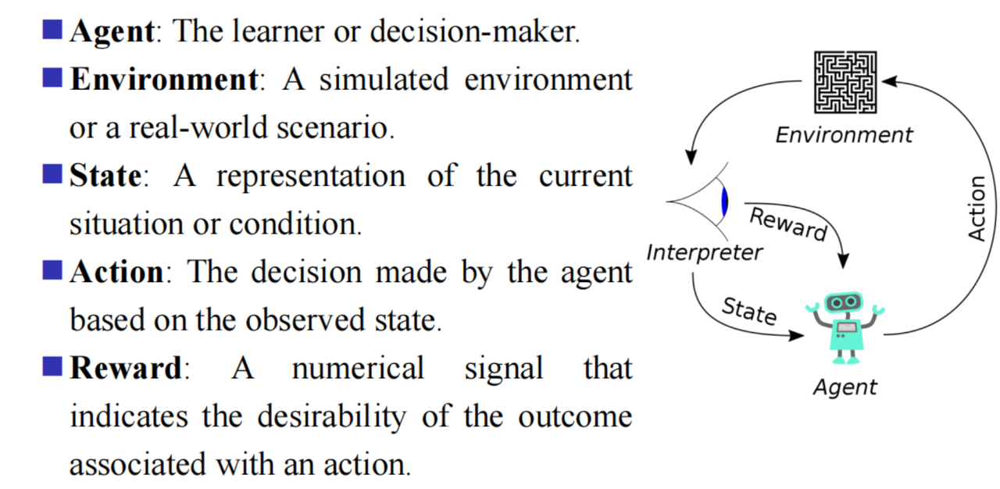

## 3. 机器学习与概率统计

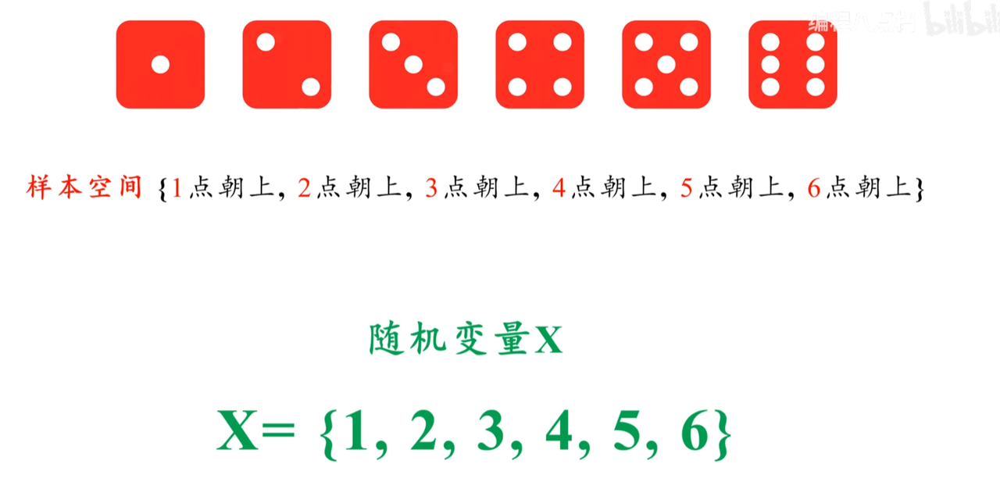

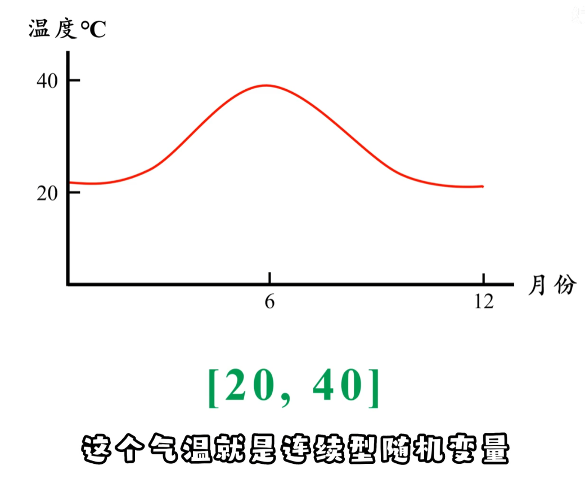

&#x20;

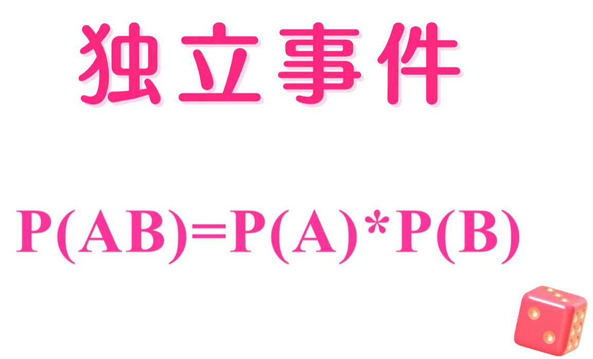

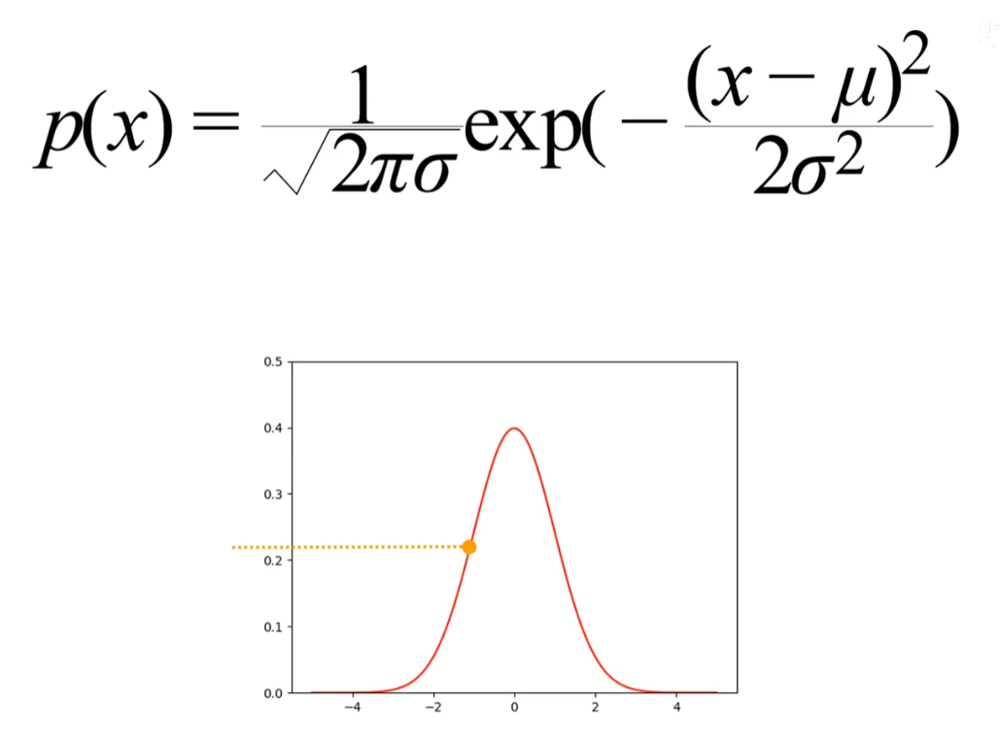

以下是机器学习常用的概率论知识，读者可回顾概率基础、连续/离散随机变量、边缘概率/联合概率/条件概率、求和规则、乘法规则、条件树、边缘概率和联合概率的知识点进行复习。

考研教材：《概率论与数理统计》 浙江大学

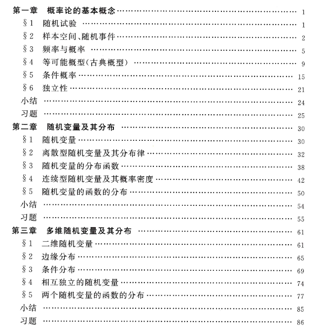

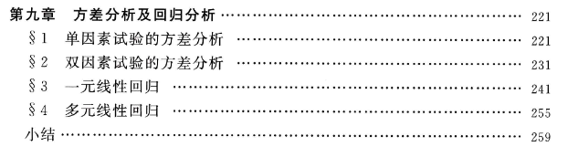

在这里，我们特别回顾一下贝叶斯理论及其推导过程。我们用一道例题来说明贝叶斯理论及其作用：

乘法规则可以推导出：P（Y, X） = P (X | Y) \* P(Y)

乘法规则也可以推出：P（X, Y） = P (Y | X) \* P(X)

两个式子经过联立，即可得到**贝叶斯公式**

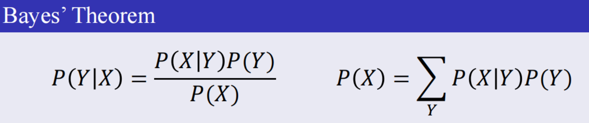

简单来说：

* 先验概率是“在没有新信息之前，我相信的概率”。

* **后验概率是“在考虑了新信息之后，我相信的概率”。**

* 边缘概率是“在不考虑其他因素的情况下，某个因素发生的概率”。

贝叶斯定理在医疗诊断等方面发挥了重要的作用。我们举一个牙科的例子进行说明：

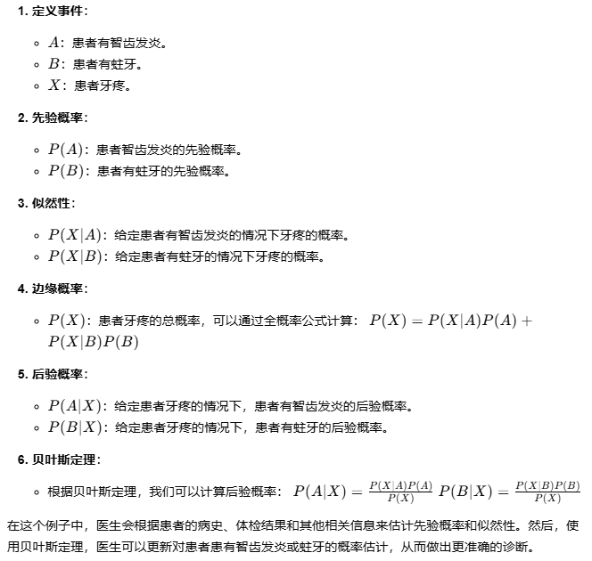

在更进阶的情况，如果加上进食冷热食物是否疼痛加剧，或者咨询患者是否经常熬夜，那么医生判定牙疼的全流程将进化成一个思维链条，通过这一个链条，医生可以更加精准地判定患者牙疼的原因。

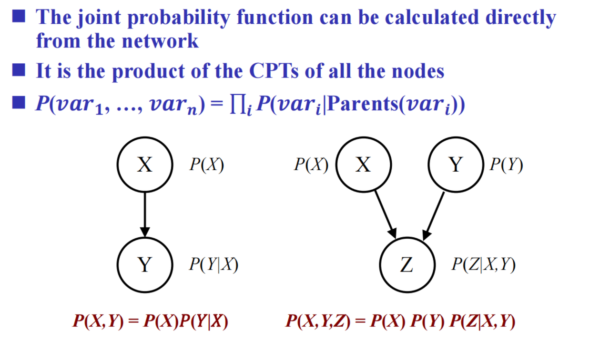

## 4. 信息论简介

信息论可以利用数学知识表示信息。我们对于一个事件 A 的信息度量是这样的：

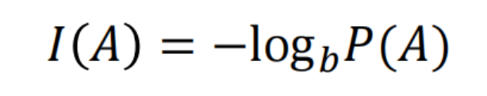

I ( A ) 表示信息的内容，是一个随机的变量

P ( A ) 表示事件发生的概率

b 是 基底文件

举个例子：某国足球谁都打不过，某国乒乓球谁都打不过。虽然中文语句是一样的，但是如果球队输球了，一个 I （ A ） 为 0， 另一个 I （ A ）为正无穷，就是因为概率差别太大了。

熵是一个用于表示预期平均信息含量的变量。

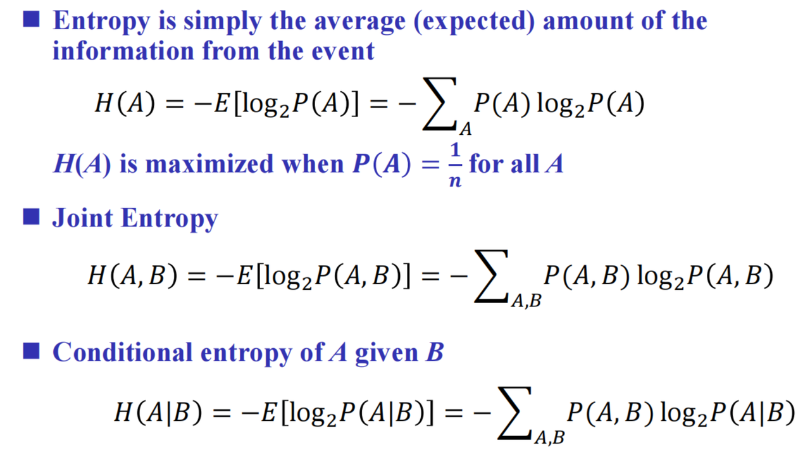

# 第二章 （重点）线性回归和梯度下降

线性回归是拟合数据的方法，梯度下降是寻找最优解的技巧。

&#x20;    除了求解闭式解之外，我们还有其他的优化方法去逼近最佳的 w 值吗？梯度下降！

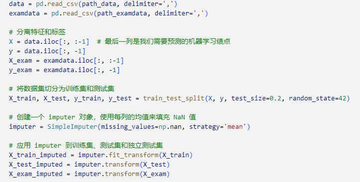

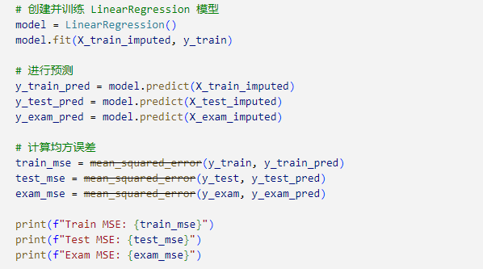

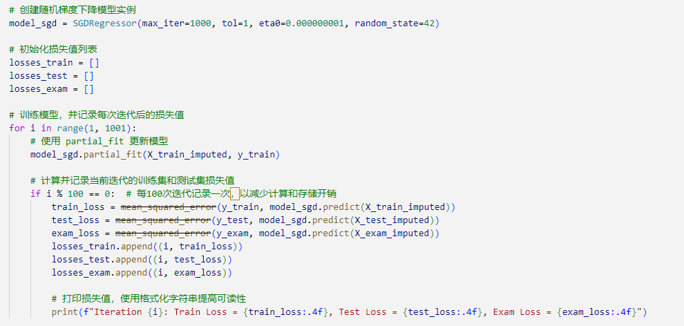

### 样例二：使用 PyTorch 的简单 API 实现线性回归

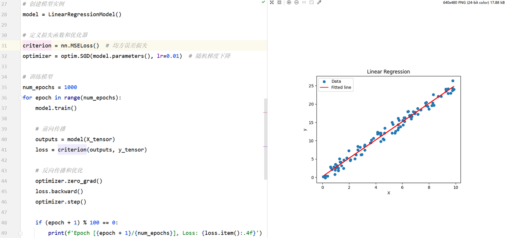

## 5. 常考面试题（4984 — 4994）

[说说你了解的机器学习是什么？ - 机器学习面试题 - 面试鸭 - 程序员求职面试刷题神器](https://www.mianshiya.com/bank/1821834636175642625/question/1821834636393746433)

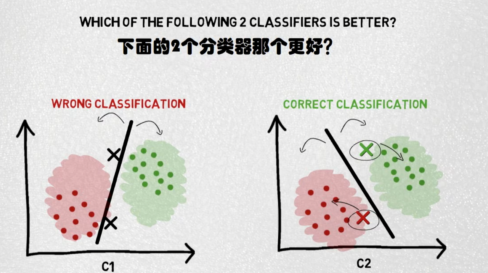

不仅尽可能保证分类的正确性，而且尽可能地加大了两个类别之间的距离，从而使得两个类别之间更容易进行区分。

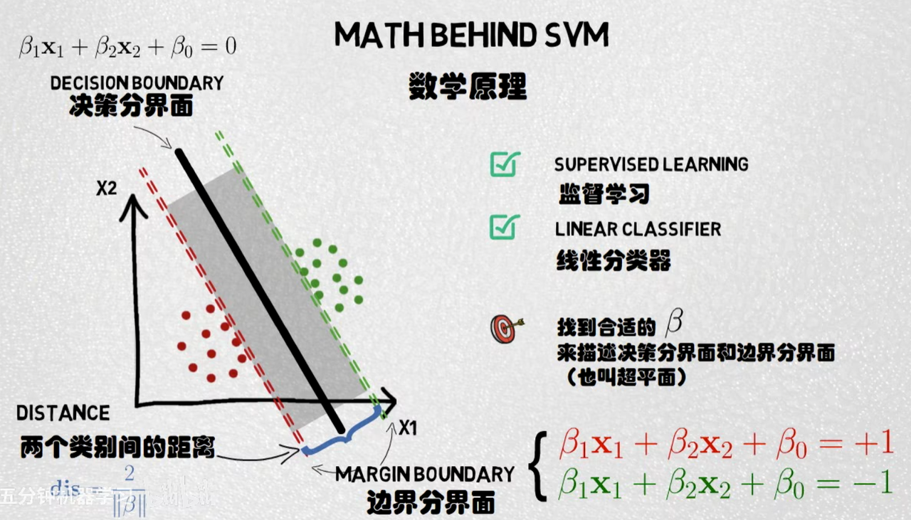

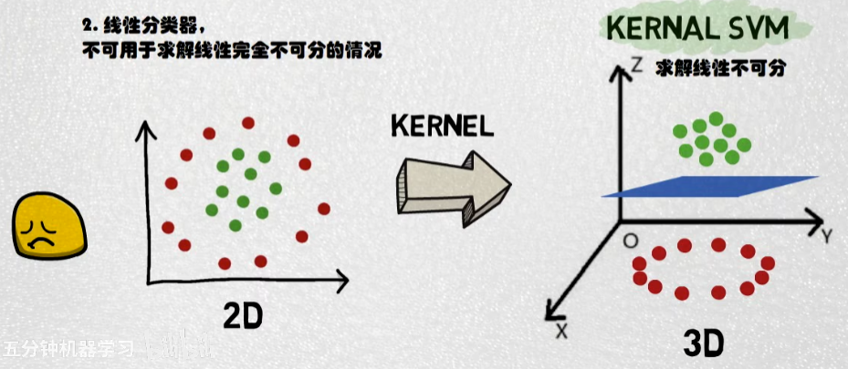

# 第三章 线性分类，**SVM**，随机梯度下降，多分类

## 1.线性分类

在实际生活中，分类是很常见的。课室的桌子是线性可分割的，而相对应的，部分美国大选的选区存在“杰利蝾螈”的现象，这种划分就不是线性可分的例子。

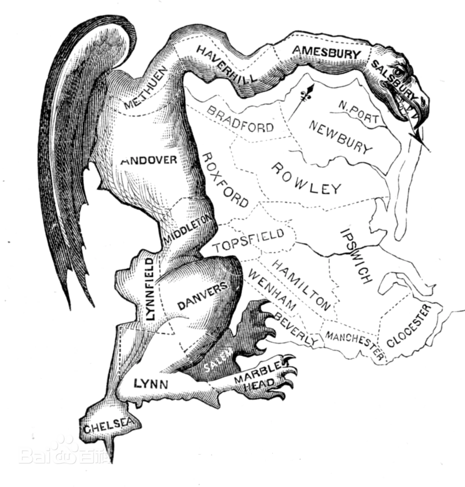

最简单的分类是二分分类，我们针对 n 个训练组 { x\[i], y\[i] }。当 x 属于实数域而 y 的取值只有 -1 和 +1 的时候，我们就可以训练一个分类器 f(x)，从而使得 f(x) 符合如下所示的规则：

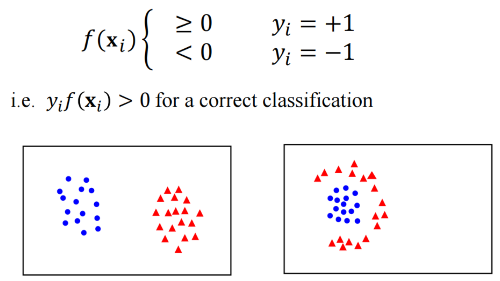

如果我们将这一个分类器进化为线性分类器，那么线性分类器有一个模式：

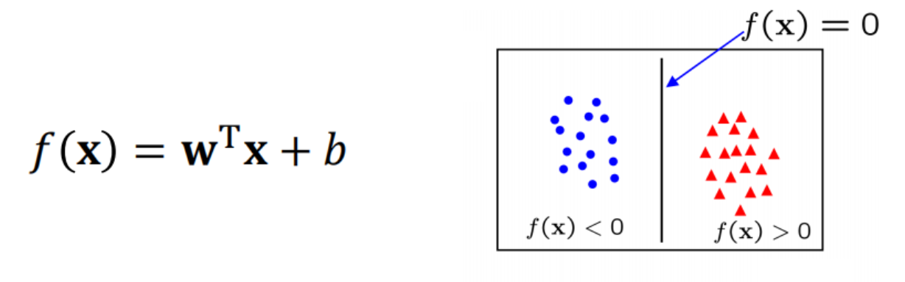

其中，在 2D 空间，这一种划分方式是一条线，w 是 normal （法线） ，而 b 是偏差 bias。w 也可以被称为是权重向量。

如果在 3D 空间的话，这一种划分方式是一个平面，m-D 是一个（hyperplane）超平面。

## 2.支持向量机 Support Vector Machine（理想情况）

在前面的讨论中，我们知道，划分的策略是多种多样的。究竟哪一种划分策略才是最佳的呢？从通用的视角看：划分的两类数据“不偏不倚”是最好的。从数学的角度看，自然是要让各个类别的 Margin （间隔）越大越好。

最大间隔解（Maximum margin solution）：most stable under perturbations of the inputs.

咱们就以笔者所在的广州珠江为例子：

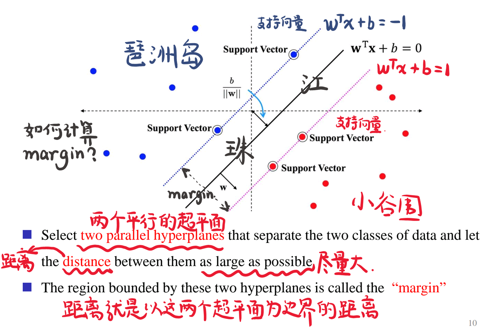

直接求解两个直线的距离即可。根据中学数学学习过的直线之间距离的计算公式，我们可以做一个简单的推导：

也就是说，SVM（支持向量机）的目的是为了优化线性分类问题，使得分类面最大最好。我们又可以根据数学换算将最大化问题转化为最小化问题。

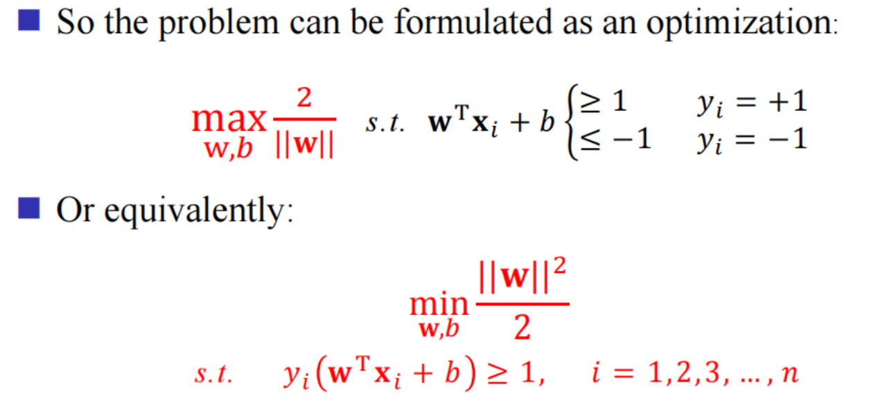

为什么我们简化了表达式的 s.t. 呢？因为**两个绝对值 ≥ 1 的同符号实数相乘的值肯定 ≥ 1**

以上的推导的基础是理想情况，但是真实的情况可能会出现疏漏等情况。所以开发者需要在寻找最优 margin 和平衡训练数据的潜在错误中去追求一种平衡状态。况且，在这种特殊情况，训练数据甚至可能无法实现线性可分割！

&#x20;       因此，虽然我们用数学推导得到了一个简洁的求解最大值的表达式，并且利用倒数的性质转化为求解最小值，但是单纯的求解最值是无法解决问题的，这就引出了接下来 要解析的概念：松弛变量

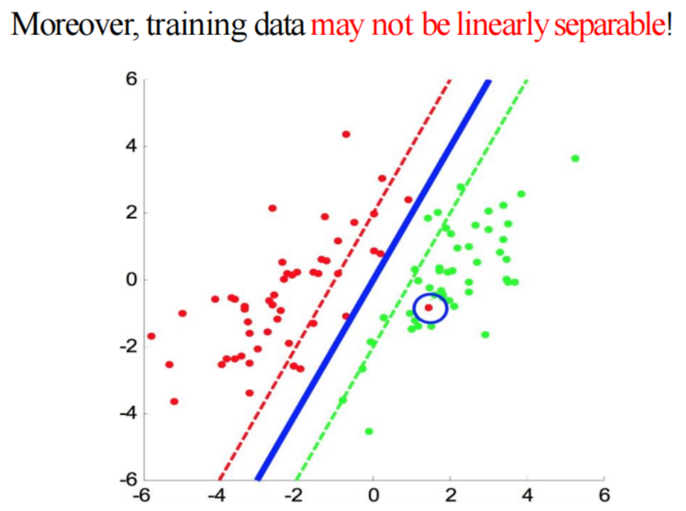

## 3.支持向量机（松弛变量）

## 不想看数学推导的同学请看专栏：

[**【五分钟机器学习】向量支持机SVM——学霸中的战斗机 - 哔哩哔哩**](https://www.bilibili.com/opus/410543902211406779?spm_id_from=333.999.0.0)

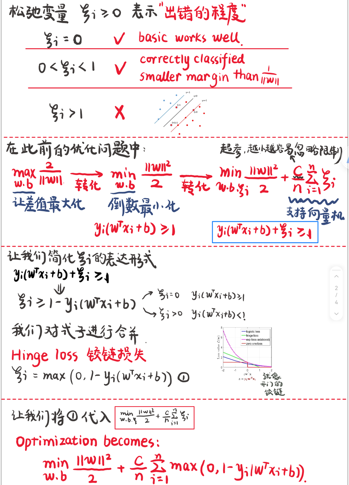

接下来使用的内容是高等数学第七版下册的偏导数，以及上册的分段函数的导数求法

分段函数的导数求法这里不赘述，我们给出偏导数的高数内容：

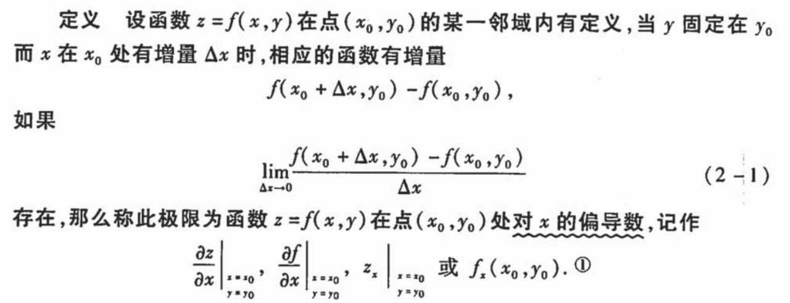

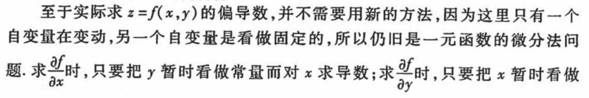

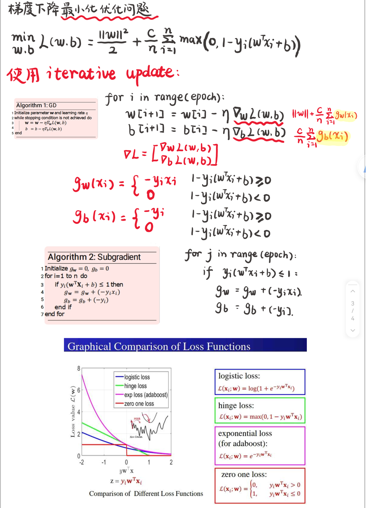

## 4.随机梯度下降

### 随机梯度下降的动力

① 样例之间信息存在冗余

② 足够的用例意味着我们可以负担得起噪声更新

③ 永不停止的流意味着我们不应该等待所有数据

④ 跟踪非状态的数据意味着目标是有挑战性的

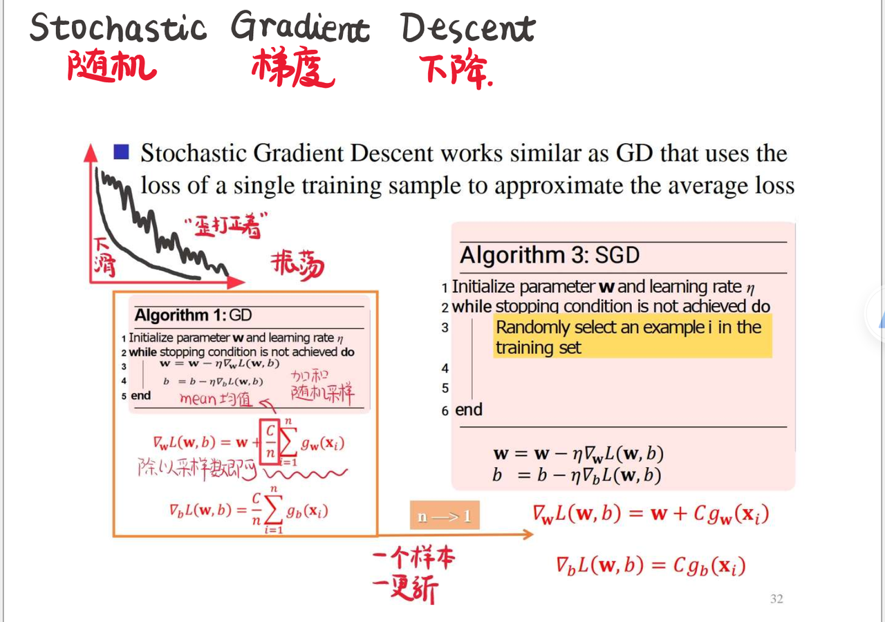

### 随机梯度下降的好处

1. 梯度易于计算

2. 不易出现局部最小值

3. 可以使用更少的内存

4. 可以快速地得到一个可行解

5. 可以用于处理更复杂的模型

### 随机梯度下降的不足

1. Variance is large 偏差大

2. Iterative algortihm 不稳定

3. 难以达到高精准度

## 5.mini-batch 随机梯度下降

与其使用一个点，我们会随机地选择一个子集 Sk，从而将优化问题转化为以下形式：

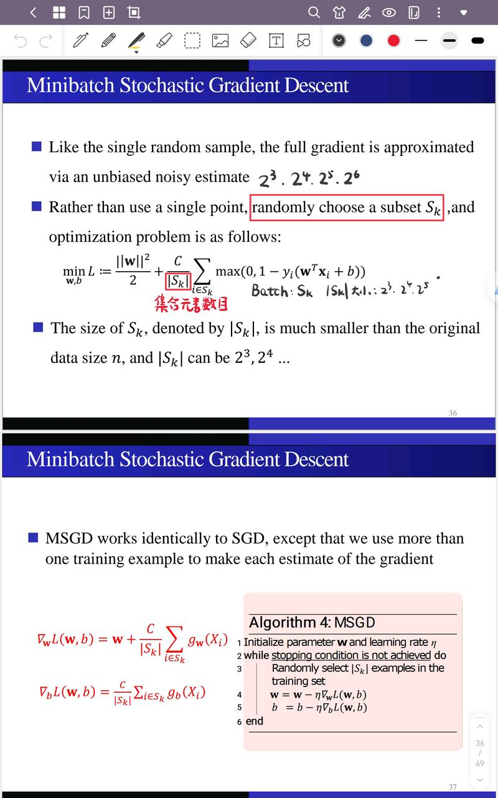

其中，Sk 的大小比原始的数据大小 n 要小，一般来说是 2^3 \~ 2^6&#x20;

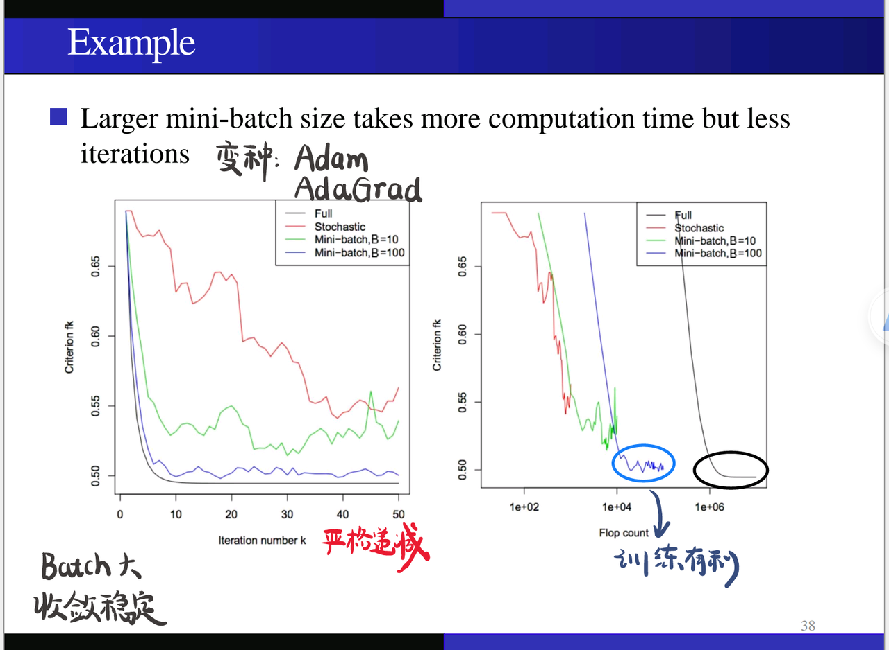

变种算法：Adam 算法 和 AdaGrad 算法

### Adam 算法（Adaptive Moment Estimation）

Adam 是一种结合了动量（Momentum）和RMSprop（Root Mean Square Propagation）思想的优化算法。它通过计算梯度的一阶矩（均值）和二阶矩（方差）的估计值来调整每个参数的学习率。具体来说：

1. **动量项（M）**：类似于动量算法，Adam 计算梯度的指数加权平均值，这有助于平滑梯度的波动。

2. **方差项（V）**：类似于RMSprop，Adam 计算梯度平方的指数加权平均值，这有助于调整每个参数的学习率，使其适应参数更新的规模。

3. **自适应学习率**：结合了M和V的估计值，Adam 为每个参数计算一个自适应的学习率，这使得算法在训练过程中更加稳定。

Adam 算法通常表现良好，尤其是在深度学习中，它能够快速收敛，并且对学习率的选择不太敏感。

### AdaGrad 算法（Adaptive Gradient Algorithm）

AdaGrad 是一种自适应学习率的优化算法，它通过累积所有梯度的平方来调整每个参数的学习率。AdaGrad 的主要特点包括：

1. **累积梯度平方**：AdaGrad 会累积所有梯度的平方和，这意味着随着时间的增加，分母会不断增大，导致学习率逐渐减小。

2. **自适应学习率**：AdaGrad 为每个参数计算一个基于其历史梯度平方和的倒数的学习率，这意味着频繁更新的参数将获得较小的学习率，而不常更新的参数将获得较大的学习率。

3. **适用于稀疏数据**：由于其自适应学习率的特性，AdaGrad 特别适合处理稀疏数据，因为稀疏数据中的非零特征将获得更大的权重。

然而，AdaGrad 的一个缺点是其累积梯度平方和可能会导致学习率过早地变得非常小，从而使得训练过程在后期几乎无法继续。

### 学习率

学习率在收敛的工作中发挥了重要的作用：

如果学习率太小 —— 收敛太慢

如果学习率太大 —— 有可能会出现发散的情况

学习率应当保持固定还是有适应性的呢？

收敛很有必要吗？

Non-stationary: 也许无法满足收敛条件

Stationary: 学习率应当随着时间而减小

### SGD 随机梯度下降的推荐

① 随机洗牌训练样本：

即使理论上我们应该选择某些案例，但是顺序地经历你的训练集是更加简单的。在每次迭代时，洗牌可以降低顺序的影响。

② 监督训练损失和验证错误：

为验证集留出样本

在训练集和验证集上计算目标函数（虽然成本较高，但比过拟合或浪费计算资源要好）

③ 使用有限的不同/差异校验梯度

错误的计算可能会导致算法不稳定且缓慢

通过轻微扰动参数并检查两个梯度之间的差异来验证你的代码

④ 利用训练样本的稀疏性

⑤ 使用训练集的小样本对学习率进行实验

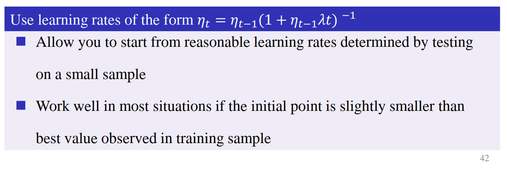

## 6.多类别分类问题的定义

在机器学习领域中，有三种常见的分类问题，分别是：

Binary Classification 二分问题

Multi-class Classification 多类别分类问题

Multi-label Classification 多标签分类问题

多类别分类问题是一种常见的分类问题，它希望把一系列的实例分解&#x5230;**&#x20;one of the more than two classes&#x20;**&#x91CC;面。

经典的数据集包括 MNIST, Cifar-10 和 Cifar-100

多类别分类问题有三种通用的策略：

① 转换：将多类别分类问题转化为二分问题，以下是样例

② 拓展：从二分问题中个拓展出解决方案

在吴恩达老师的机器学习中，老师重点强调了 K-nearest neighbors 分类的策略：

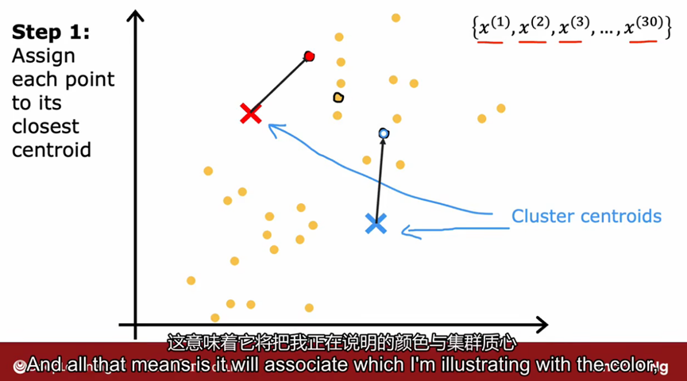

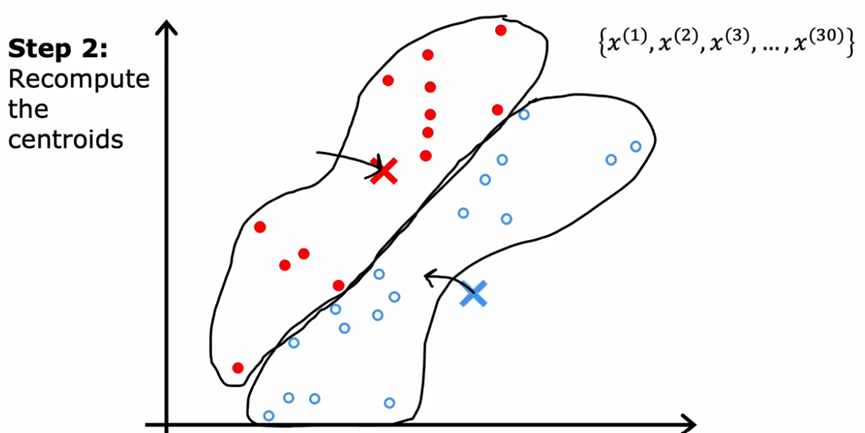

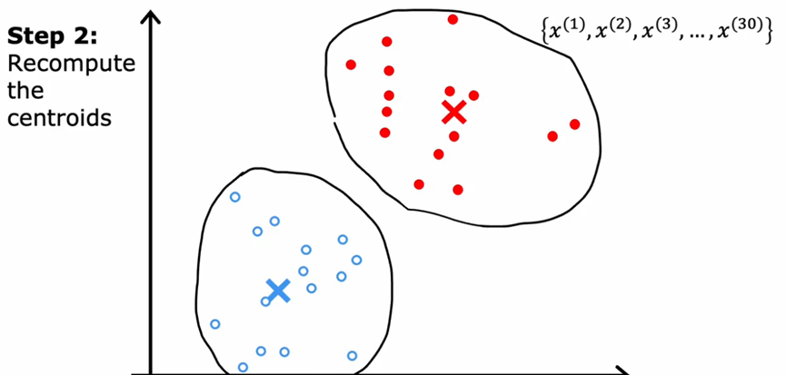

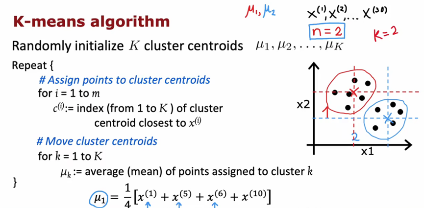

好处：无参分类算法、可以自然地处理二分分类和多分类问题

劣势：计算资源和内存需求高，用非欧氏距离的概念去定义对象的距离是很难的

③ 层级：采用层级化的分类结构

Label Tree（标签树）发挥了很重要的作用：

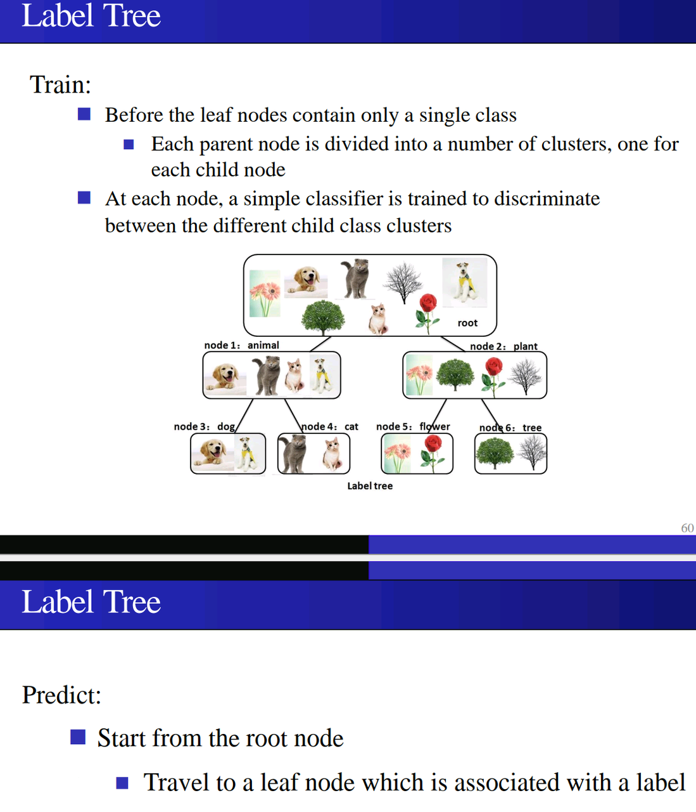

好处：树的数据结构可以降低预测的成本

坏处：过于依赖好的聚类方法

## 利用 PyTorch 解决简单的分类问题

## 常考面试题（面试鸭）

### 请描述支持向量机 SVM 的基本思想和应用场景

https://www.mianshiya.com/bank/1821834636175642625/question/1821834644434227202

### SVM 可以处理多分类吗？如何处理多分类？

https://www.mianshiya.com/bank/1821834636175642625/question/1821834644706856961

### 简单说说核函数的原理？

https://www.mianshiya.com/bank/1821834636175642625/question/1821834645583466498

### SVM 有哪些核函数？分别应用于哪些场景中？

https://www.mianshiya.com/bank/1821834636175642625/question/1821834645872873474
