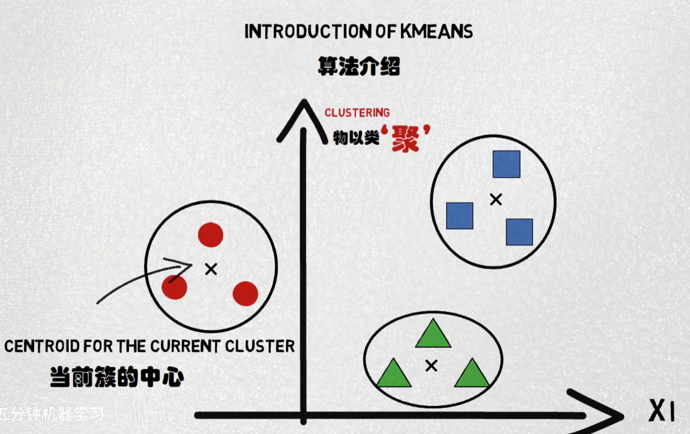

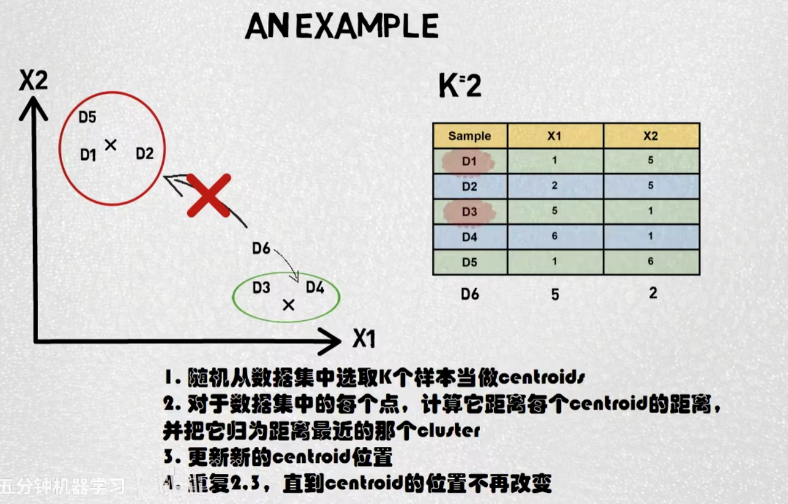

# 第七章 无监督学习：聚类问题

## 一、介绍

有监督学习：Data D = {...(x\[i], y\[i])...} 是有目标值的

有监督学习方法有哪些呢？线性回归、逻辑回归、朴素贝叶斯神经网络Naive Bayes Neural Nets、支持向量机 SVMs. etc.

除了朴素贝叶斯神经网络不考外，其余的都考。

无监督学习：Data D = { x\[1], ... x\[n] } 是没有目标值的

**对于无监督学习，我们的目标是什么呢？**

理解数据、总结数据、提取概念

无监督学习的案例：根据特征将动物聚类、将图片数据聚类、理解基因规律

## 二、聚类基础

聚类是一种发现结构的简单 idea（想法）

我们需要从一组组相同的案例中去：

① 理解数据 ② 降维 ③ 预处理未被标记的数据，提取有监督学习的概念

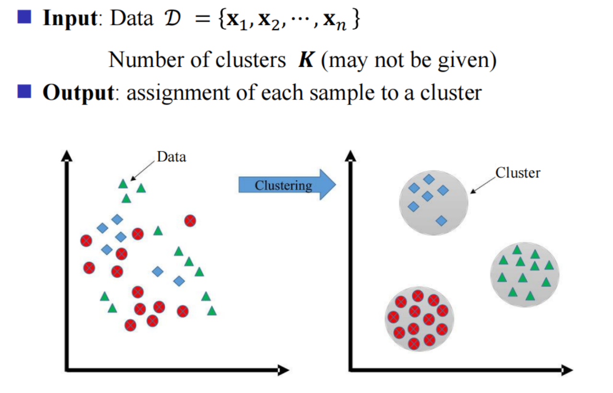

问题一：如何评估聚类是否好呢？

Samples are "more similar" to the samples in their cluster than to examples in other clusters.

样本与其所在聚类中的样本“更相似”，而不是与其他聚类中的样本相似。

问题二：如何衡量相似度呢？

欧氏距离是十分普遍使用的方法，当然，我们也可以用 DNA 的编辑距离，或者对位向量使用汉明码。

拓展：[代码随想录](https://www.programmercarl.com/%E4%B8%BA%E4%BA%86%E7%BB%9D%E6%9D%80%E7%BC%96%E8%BE%91%E8%B7%9D%E7%A6%BB%EF%BC%8C%E5%8D%A1%E5%B0%94%E5%81%9A%E4%BA%86%E4%B8%89%E6%AD%A5%E9%93%BA%E5%9E%AB.html)

[72. 编辑距离 - 力扣（LeetCode）](https://leetcode.cn/problems/edit-distance/description/)

核心代码：

完整代码：

## 三、K-Means 聚类（重点！）&#x20;

参考网课：[2.2 K-means的直观理解\_哔哩哔哩\_bilibili](https://www.bilibili.com/video/BV1Bq421A74G?spm_id_from=333.788.videopod.episodes\&vd_source=da1f2d78d73dfaae6ddfbcfe8e4801d8\&p=103)

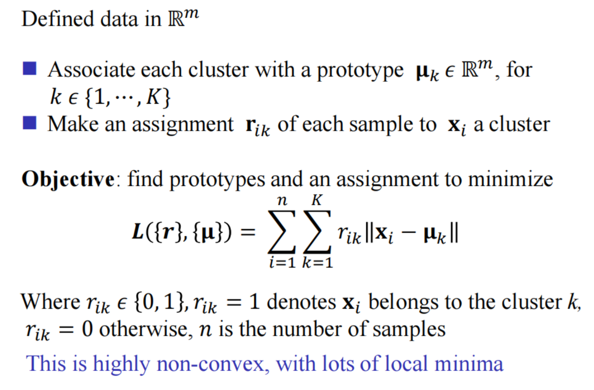

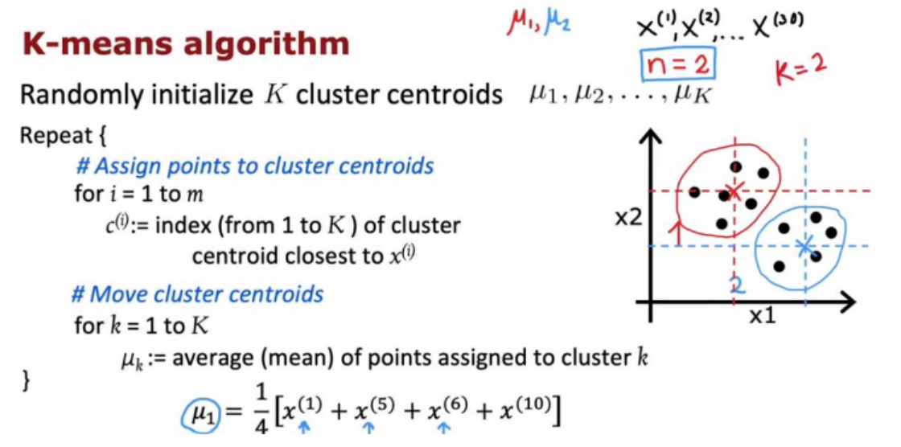

### Numpy 实现

相信大家看到一大堆英文和代码已经晕头转向了

但是如果我跟大家说：K-Means 聚类算法其实就是把 聚类问题 转化为 求解最佳中心 的问题的话，大家应该会比较好理解。接下来我们看看吴恩达老师的样例：

序、N 个类别就有 N 个中心，随机选择 N 个点，叫做 Cluster **centroids**

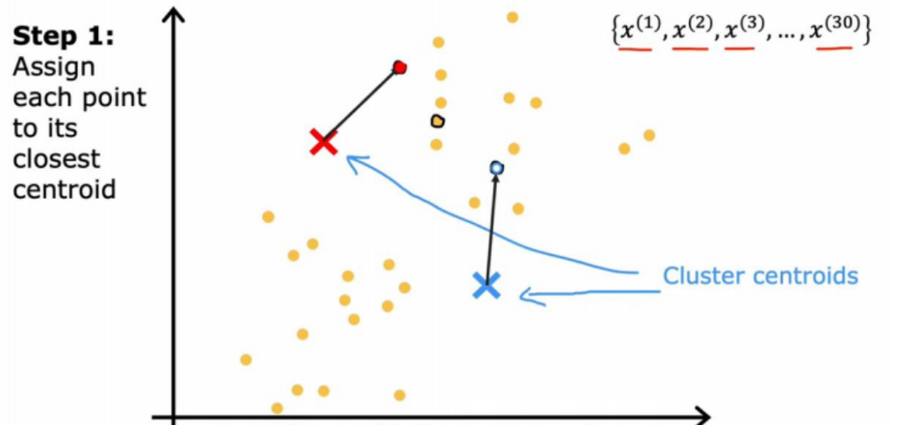

第一步：每一个点都可以分配一个最近的中心

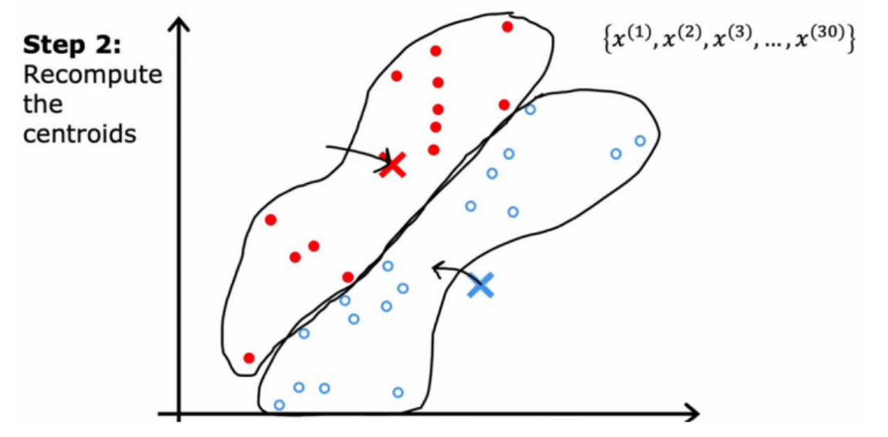

第二步：重新计算新的簇的中心点

第三步，重复以上两步，直到达到循环截止的条件为止

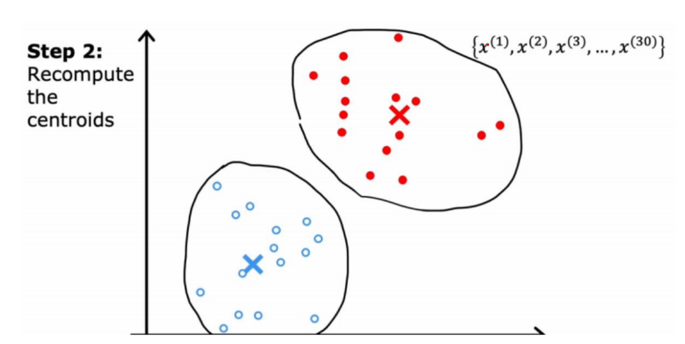

### Lloyd's Algorithm 小结

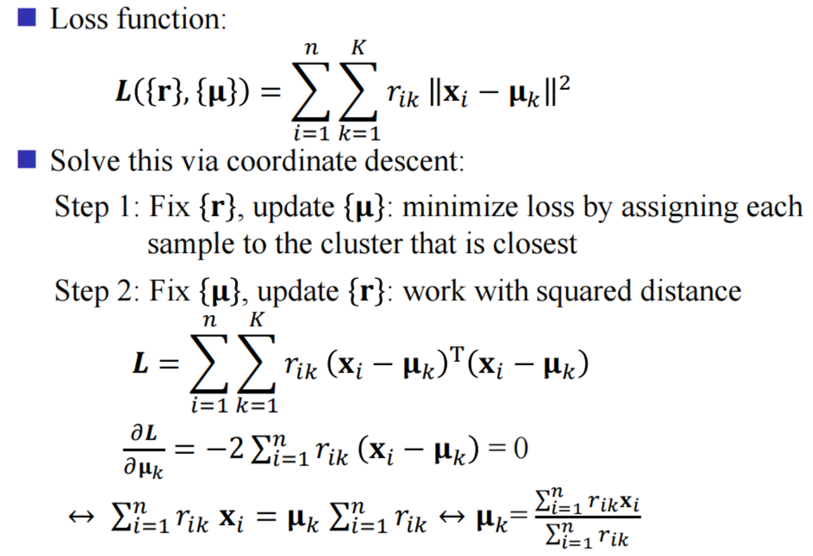

这是一种简单且流行的方法。有效的参数总数是 m（样本维度）× K（聚类数目）

但是，如果线性决策边界失效的话，这种方法不管用了

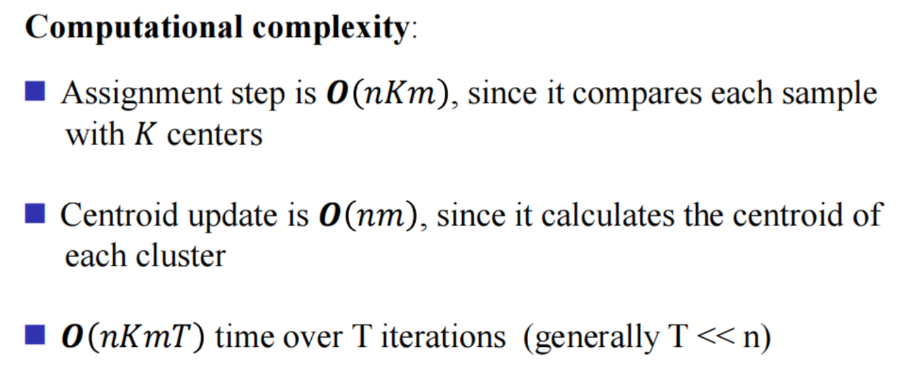

我们如何设置聚类的数目 K 呢？

更小的聚类：may provide better interpretation（更方便解释）

更大的聚类：useful if clustering is being used for feature extraction（在特征提取的时候很有用）

现在没有一个准则化的方法去设置 K

“A heuristic approach is to plot loss against K, and look for a ‘Knee’ in the plot” 翻译成中文是：“一种启发式方法是绘制损失函数与K的关系图，并在图中寻找‘拐点’。” 这里的“拐点”（Knee）指的是在损失函数与K值的关系图中，损失开始显著下降的点，这个点之后损失的下降速度会减缓，通常用来确定最佳的K值，即聚类的数量。

让我们来看看吴恩达老师给出的小结：

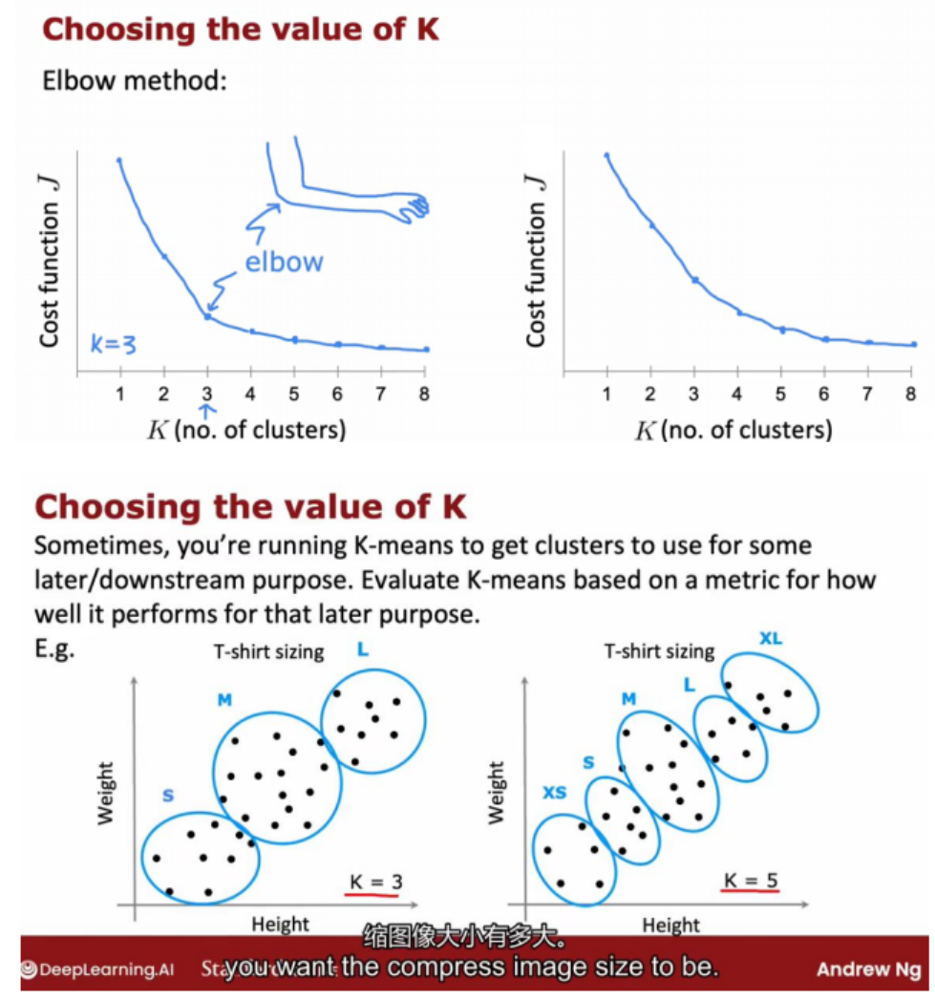

在 T-shirt 的例子中，K = 3 方便解释，K = 5 可以细化衣服的尺寸分类，有助于更细致的特征提取。&#x20;

## 四、层次聚合聚类 Hierarchical Agglomerative Clustering （HAC）

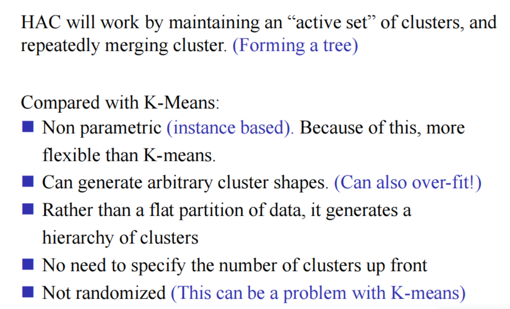

HAC 算法通过维护一个“活跃的聚类集合”以及不断地合并聚类来实现分类的功能。

相对 K-means 来说

① 不是参数依赖的（实例依赖型）—— 更加灵活

② 可以生成 **任意形状的聚类**

③ 生成层级的聚类，聚类不只是“在平面切分”的

④ 不需要在聚类之前指定聚类的数目，也不是随机的（随机性对于 K-means 来说可能是个问题）

看到实例，大家可以发现 HAC 算法的三步走：

① 我们将每一个样本 sample 都当做一个聚类

② **将两个最接近的聚类合并到一起（用哪个值定义近呢？）**

**Value = min max average centroid 似乎各有各的道理**

③ 重复以上两个步骤，直到绝大多数的聚类都被合并到一起为止

说实话，也没有规定最接近的标准，这里给出四种判定方法的求解公式：

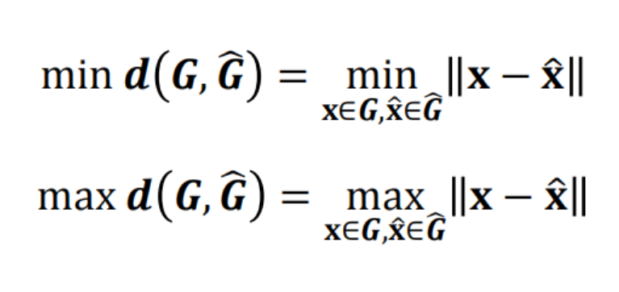

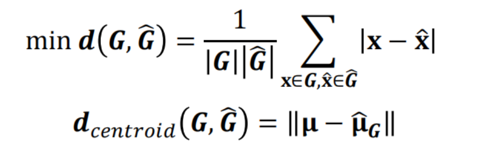

问题一：四种距离中，究竟哪一种距离倾向于将大的聚类相互合并呢？

回答：**min** 大的聚类更有可能有一对实例相互接近。

问题二：究竟哪一种距离倾向于存在 "chain effect"（链式效应），从而推导出长的字符类型聚类？

回答：**min** 因为只有一个实例必须要成为相对小的那一个。

问题三：究竟哪一种距离倾向于喜欢紧凑的聚类呢？

回答：**max** 因为所有的距离为了合并都必须变得尽量小。

接下来的几种案例，相信大家也可以自行推导了，这里直接给出结果：

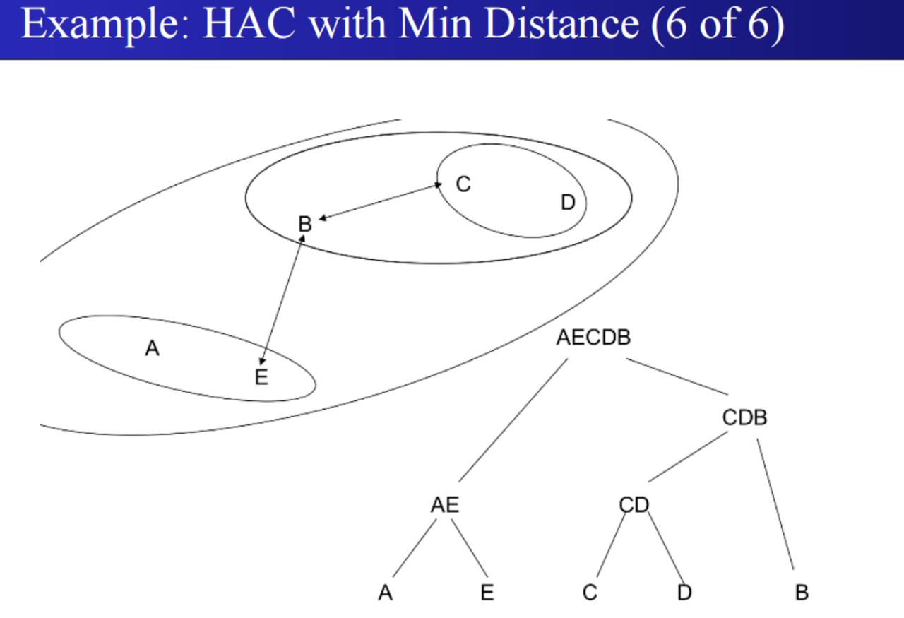

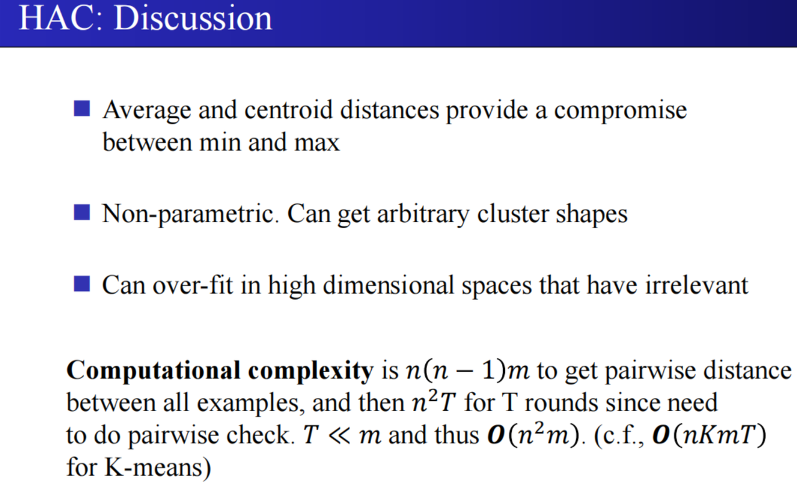

维度诅咒（Curse of Dimensionality）

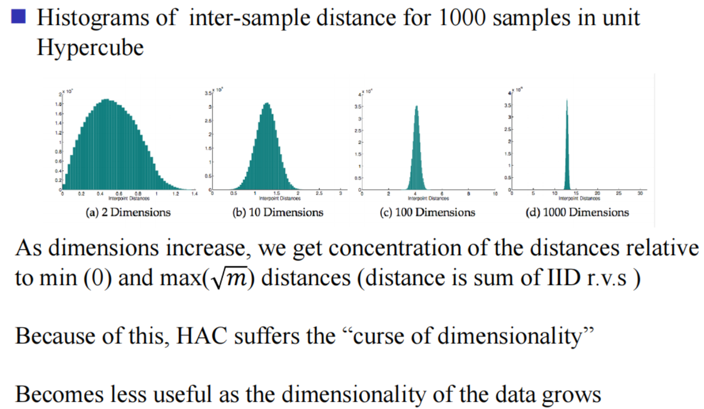

## 五、小结

聚类是一种非常自然的无监督学习问题

K-means 算法 和 HAC 是两种简单但是流行的算法

HAC 更加灵活，但是在高维度问题的表现不佳

# 第八章 主成分分析降维技术

## 一、引言

主成分分析（PCA）是一种用于降维的统计技术。它通过将数据转化为一组新的变量（主成分），来减少原始数据的维度，同时尽可能保留数据的变异性。主成分是原始变量的线性组合，能够帮助我们识别数据中的主要结构和模式。

PCA的主要步骤包括：

1. **标准化数据**：确保每个特征对分析的贡献相等。

2. **计算协方差矩阵**：分析变量之间的关系。

3) **特征值分解**：找到特征值和特征向量，以识别主成分。

4) **选择主成分**：根据特征值的大小选择前几个主成分。

5. **转换数据**：将原始数据投影到选定的主成分上，从而实现降维。

通过这一过程，PCA能够帮助我们简化数据，去除噪声，同时保留重要的信息，是数据预处理和可视化中常用的方法。

高度相关的数据、大数据的维度诅咒和高度污染的数据源让开发者产生了本能想法：**我们只对一些有用的列感兴趣！**

降维可以让数据尽量简化，方便处理，接下来要介绍的 PCA 主成分分析，就是用于压缩的。

## 二、数学推导

.png>)

请大家注意，**老师上课曾经讲过，w1 如果没有提及，我们按照列向量来处理！**

在概率论的时候，我们学过了方差与协方差的概念，参考知乎：[方差、标准差、协方差、相关系数](https://zhuanlan.zhihu.com/p/266161140)

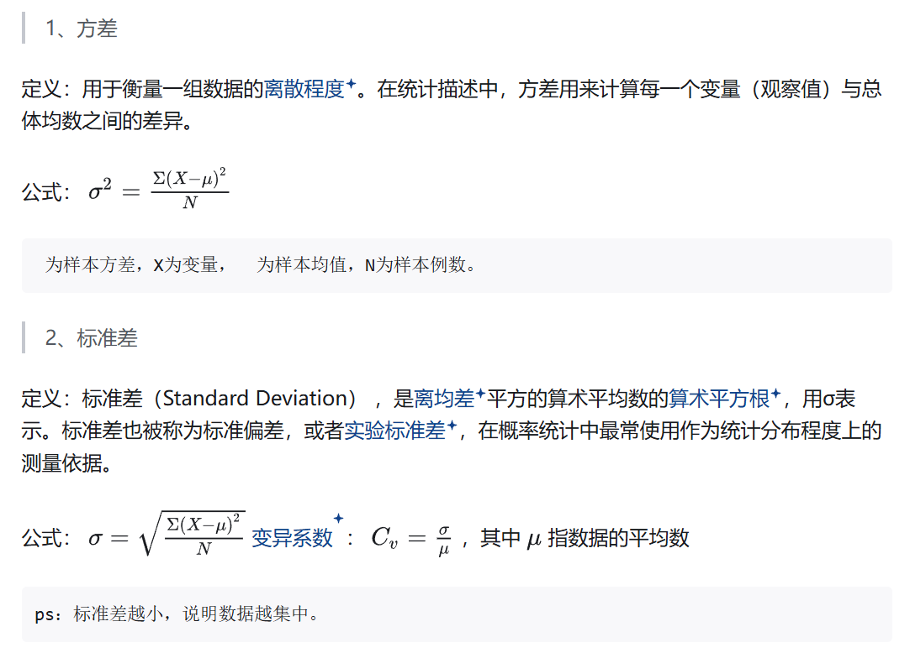

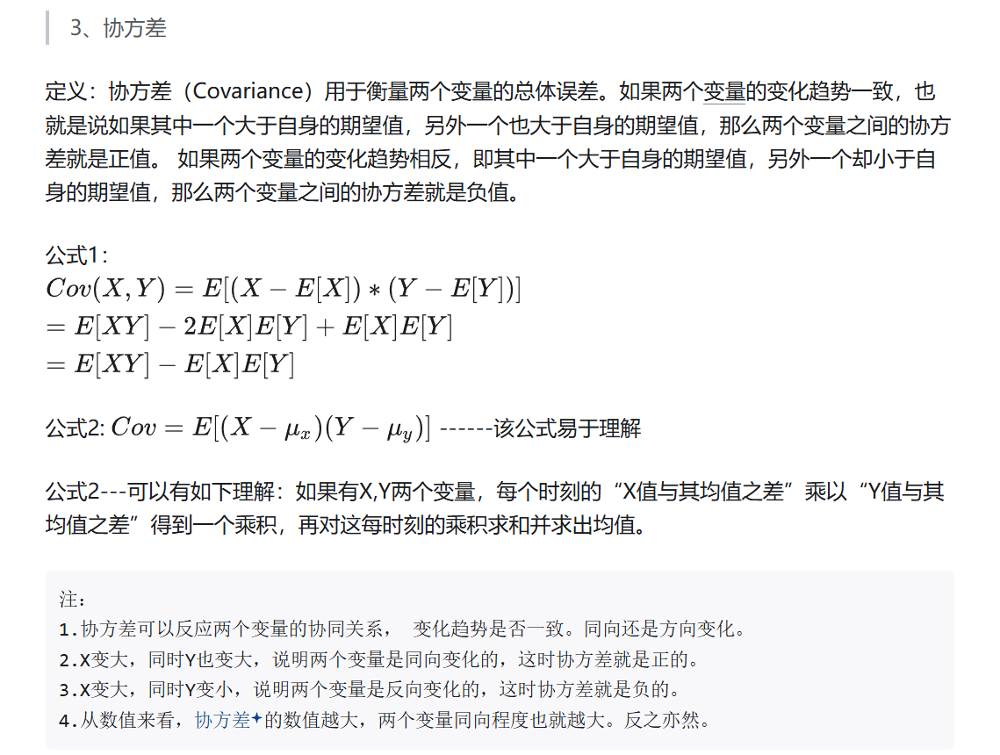

有了这两个概念，让我们稍微拓展一下 N 维的方差计算问题：

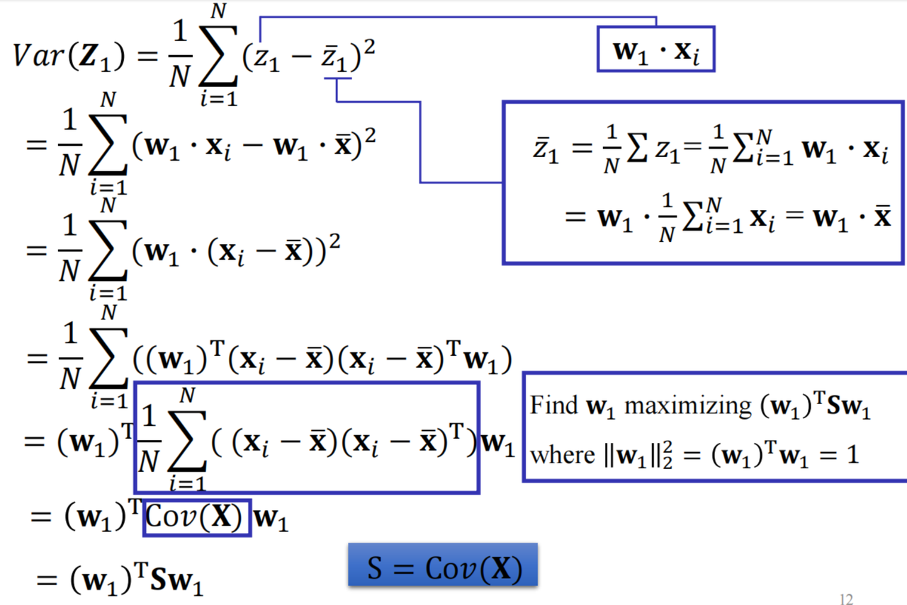

太好啦，我们只需要求解⬆️这个式子的最大值，我们就可以降维啦

根据拉格朗日乘数法（打住，什么是拉格朗日乘数法来着？这个东西有啥用？）

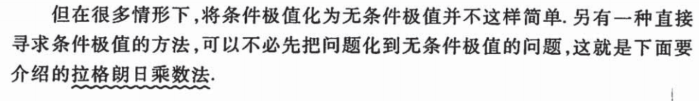

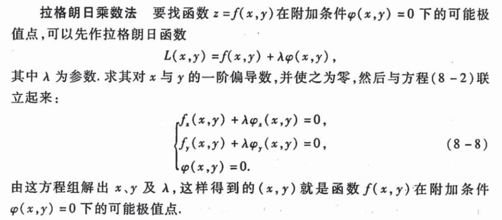

那极值和最值又是什么关系呢？

极值不一定是最值，但是最值极大概率是极值，严谨的数学推导请移步《数学分析》《高等数学》。

备注：其实有的数学课本的正号是会写成负号的，这样子求解的时候方便一点儿，大一的小朋友可以试试。但是正负号对最终的结果影响不大，老师只看你最终的解是否符合要求。

我们把思路拉回来，代入拉格朗日乘数法的公式，我们可以得到：

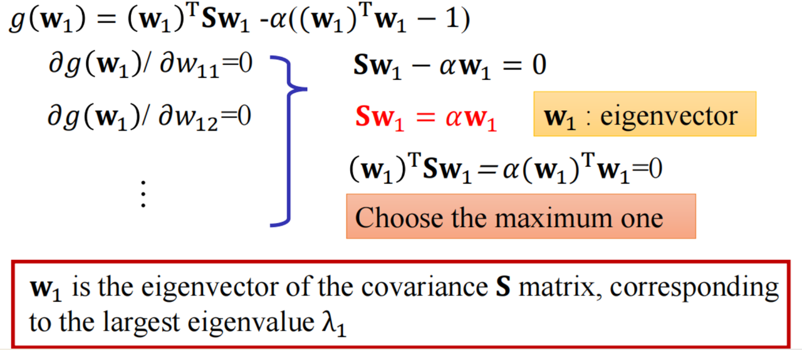

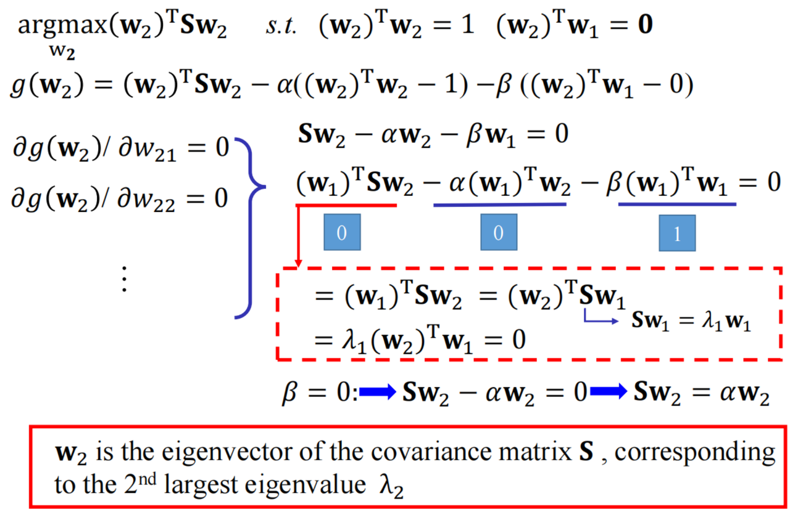

所以，究竟应该如何降维呢？

① 计算协方差矩阵 S

② 对于每一个 w，选择一组正交归一特征向量，从而计算出一个投影矩阵 W

③ 计算 Z = WX

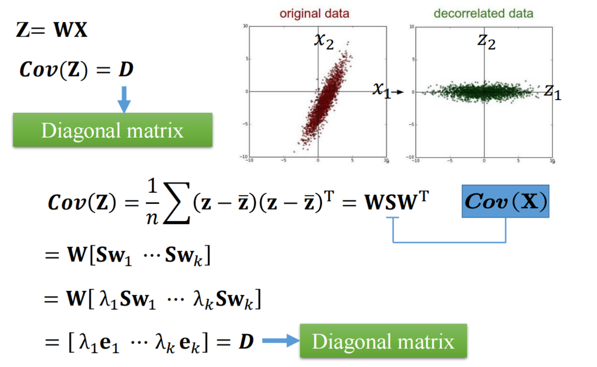

最小错误公式

让我们来解析经典的 MNIST 手写识别：

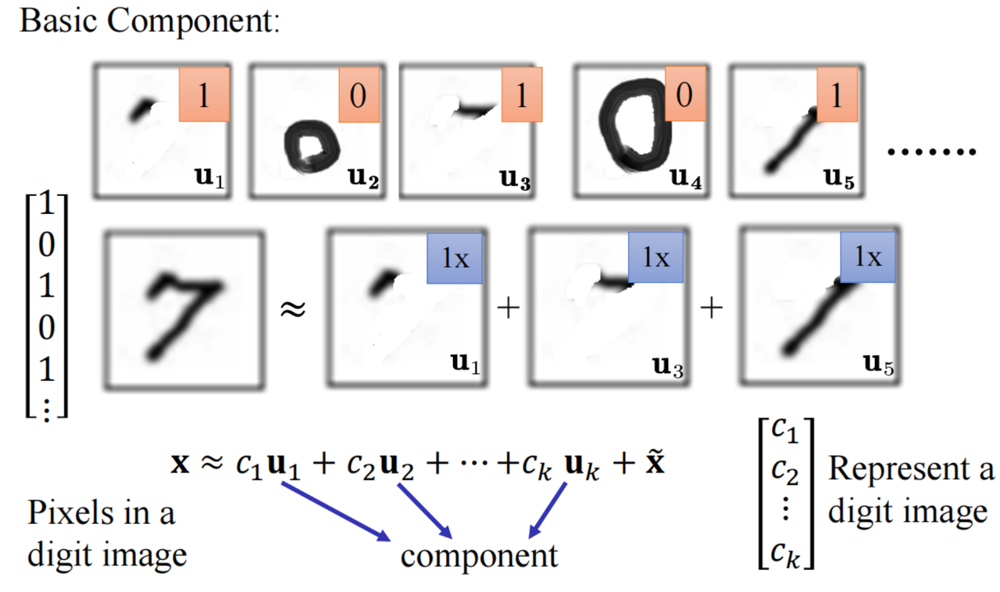

我们可以从无数手写体拆除出一些“组件”，这些组件可以通过排列组合和放缩凑出千奇百怪的 0 \~ 9

在这里，我们选取了 u1, u3, u5，那么我们的位图就长这个样子：\[1, 0, 1, 0, 1]T

此时 实际图片 ≈ 降维矩阵相乘的结果 + 缺少的那一块营养

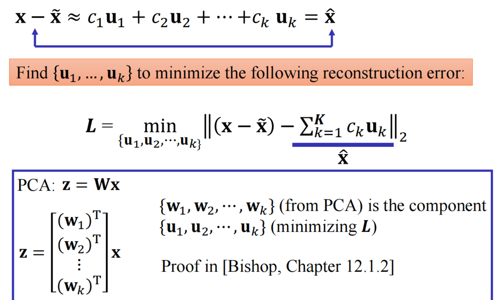

按照惯例，大家肯定知道，我们需要从特殊到一般，从 x1 拓展到 xn 啦

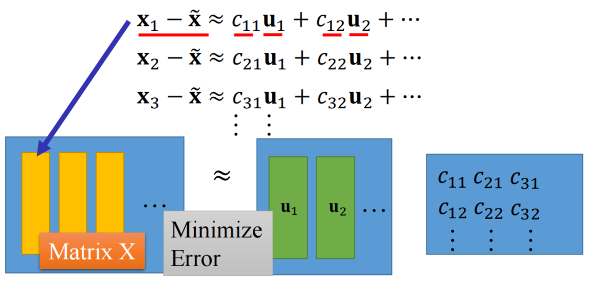

我们需要做到的事情是：让降维后的图片尽量贴近真实图片，以上数学公式是对这个概念的抽象化。

但是，大家都知道，矩阵乘法需要特别考虑维度的问题，如果维度不匹配，那么是乘不出来的。

所以我们需要一个中间矩阵，这个矩阵的维度是 K × K，这一批 **正交归一特征向量&#x20;**&#x7684;重要作用就是在不影响矩阵相乘的情况下还能让最小化的公式成立：

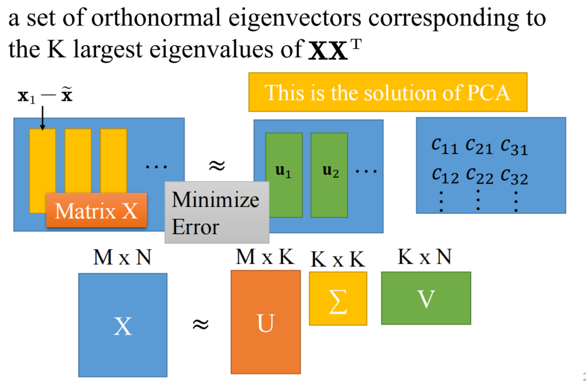

给大家一个数学式子对应一下

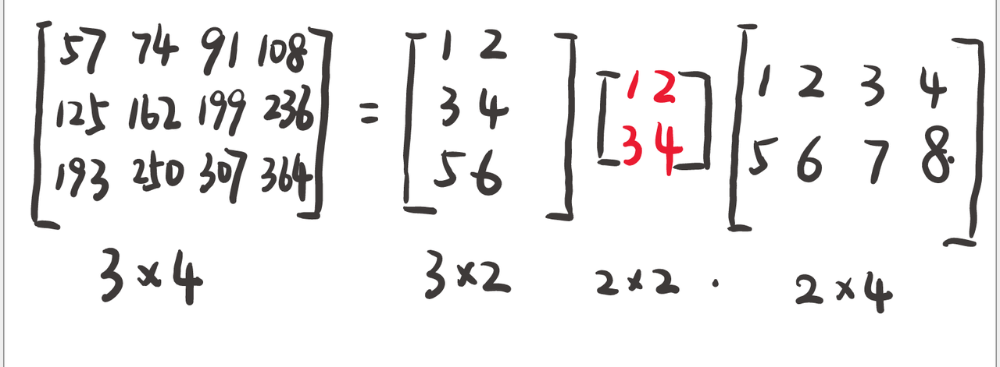

Pytorch 算矩阵乘法

大家再仔细看看 PCA 算法，会不会发现 PCA 算法很像一个神经网络啊？这个网络只有一个隐藏层（线性激活函数）

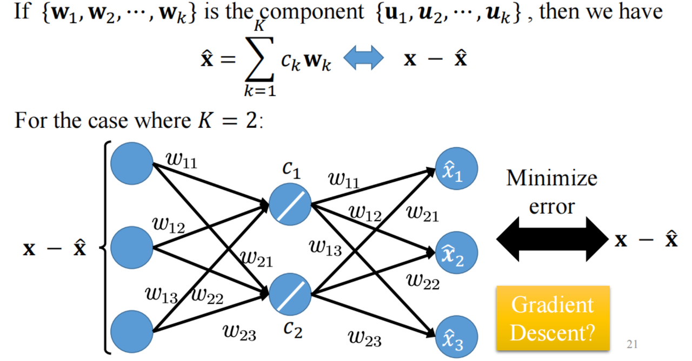

想知道神经网络是怎么回事吗？且听下回分解。

## 三、样例

宝可梦数据咱们获取不到了，但是我们可以通过降维技术，将宝可梦的六个特征精简到四个特征。

MNIST 手写体虽然只需要从 0 \~ 9 十个选项中选一个，但其实可以拆分出 30 个组成：

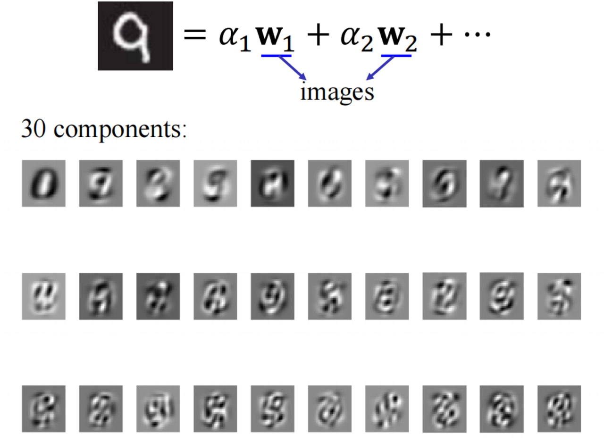

人脸识别也一样

## 四、小结

# 利用 Pytorch 构建出简单的 K-Means 算法

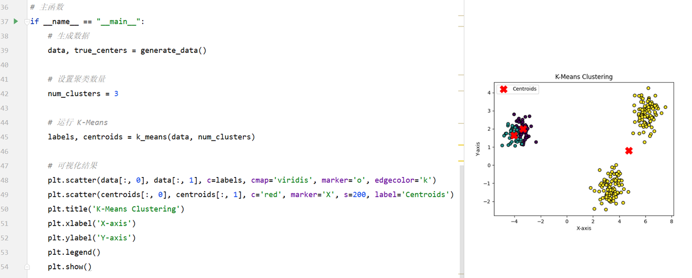

# 利用 Pytorch 实现主成分分析降维技术

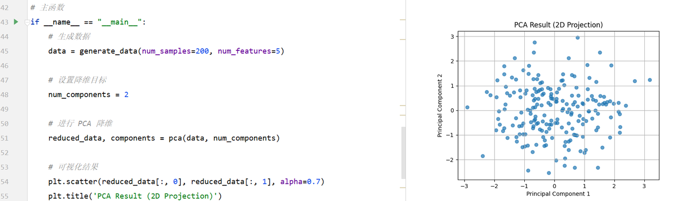

# 面试鸭常考面试题

## K-means 算法

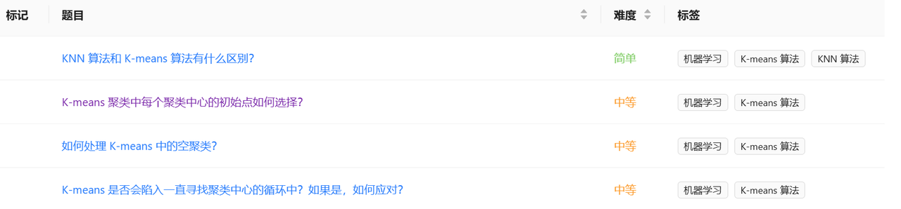

https://www.mianshiya.com/bank/1821834636175642625/question/1821834642555179009

https://www.mianshiya.com/bank/1821834636175642625/question/1821834643079467009

https://www.mianshiya.com/bank/1821834636175642625/question/1821834643331125250

https://www.mianshiya.com/bank/1821834636175642625/question/1821834643612143617

## 降维技术

https://www.mianshiya.com/bank/1821834636175642625/question/1821834653946908674

https://www.mianshiya.com/bank/1821834636175642625/question/1821834654223732738

