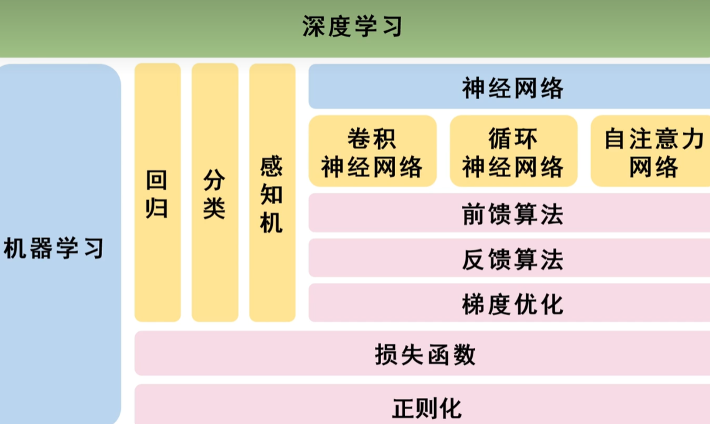


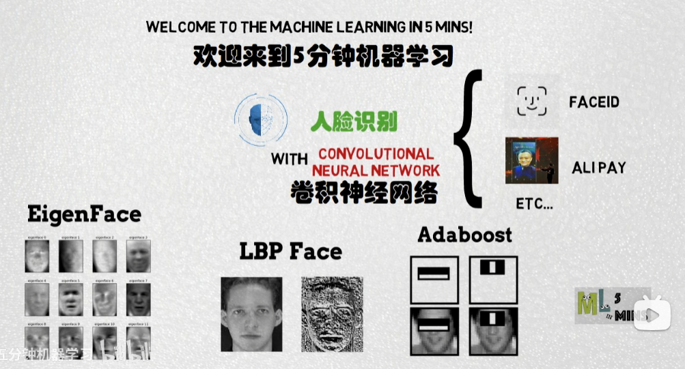

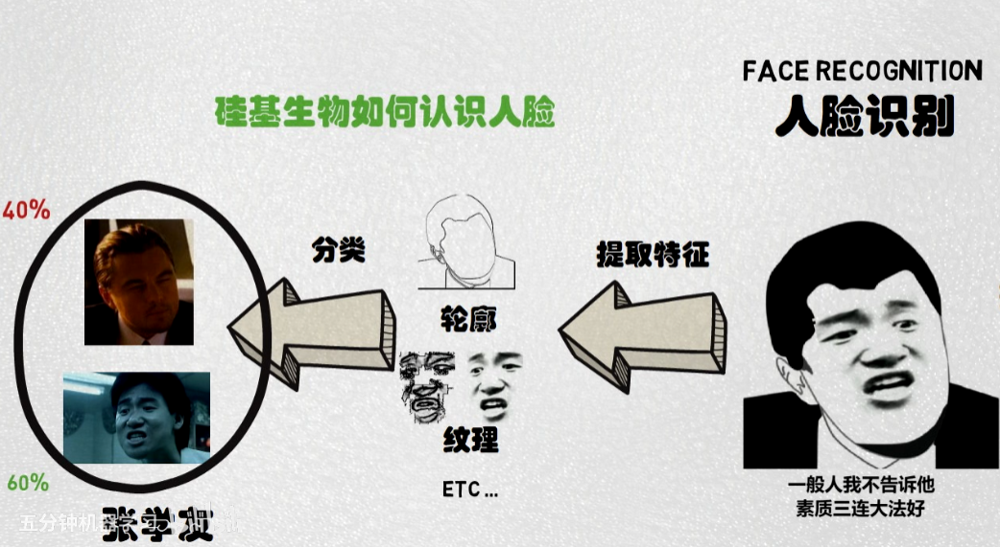

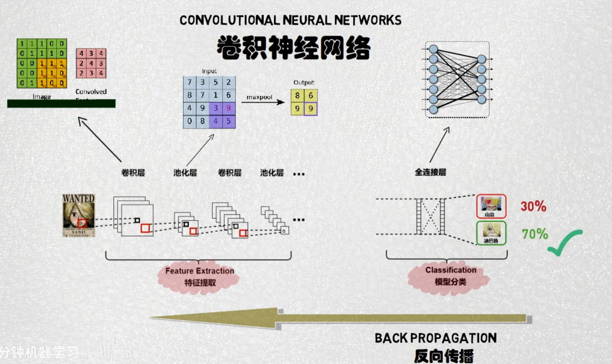

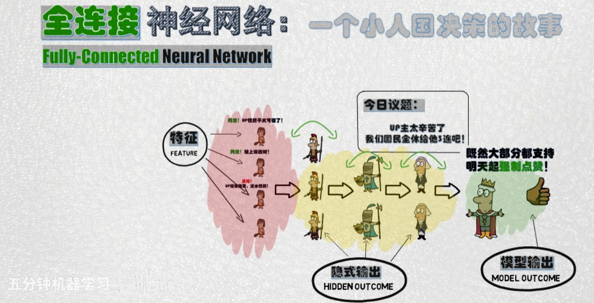


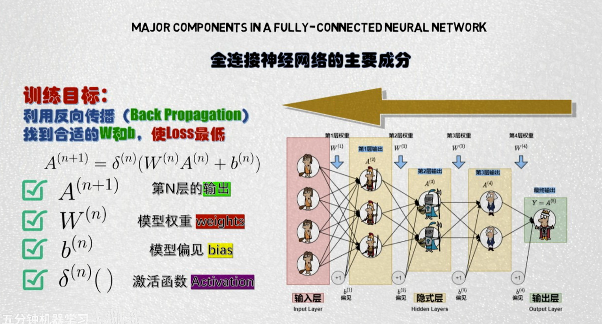

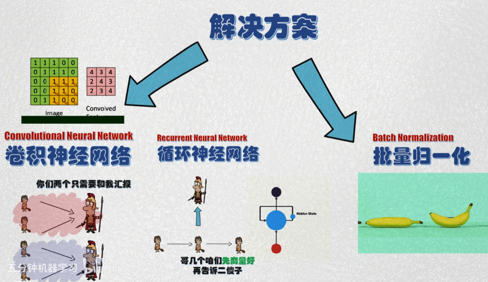

# 第十一章 神经网络和深度学习：以 CNN 为例

## 序、快速入门神经网络（老师独家版）

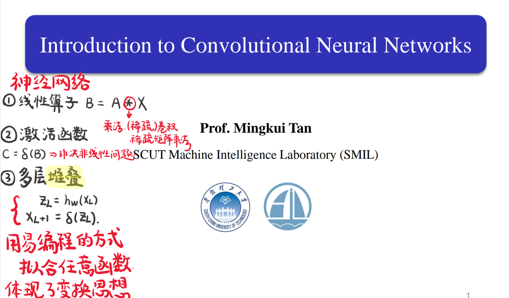

自己去玩一玩神经网络：<https://playground.tensorflow.org>

## 一、介绍

对于人来说，看到一个订书机并且辨别出来是很容易的。但是对于计算机来说，进行图像识别就像是“盲盒”。因为我们在计算机组成原理学过，计算机最擅长的其实是二进制计算，准确的说，是转化为矩阵的二进制计算。所以我们就需要进行以下三步走了：

① 特征抽取（Extraction）

② 特征工程（Engineering）

③ 特征表示（Representation）

传统的图片识别算法是怎么样的呢？采用我们之前讲过的线性分类器！

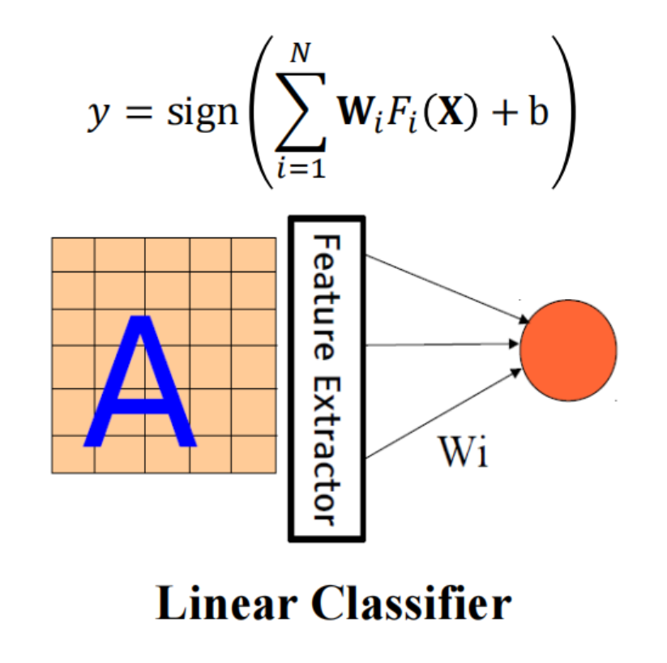

这种方式非常依赖被提取特征的质量，并且需要开发者做出很大程度的努力。

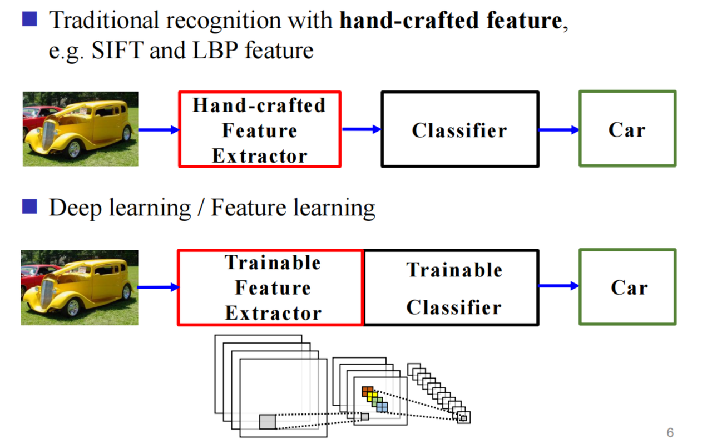

因此，深度学习 / 特征学习被提出来就是解决之前 **hand-crafted feature** 存在的缺陷的。通过模型合并，深度学习可以将特征提取的过程自动化，工程师只需要关注开头和结尾（所以被称为 end-to-end learning）。这种方法减缓了工程师的麻烦，性能也比人工的特征提取好很多。

所以，什么是深度学习呢？形象一点的说法就是：去找一个函数拟合生活中的现象。

正式的定义：**深度学习**（英语：deep learning）是机器学习的分支，是一种以人工神经网络为架构，对资料进行表征学习的算法。

## 二、神经网络

人类很容易识别图像，但是机器很难 → 能不能将人类识别图像的行为进行模型化呢？→ 神经网络！

在中学生物学的时候，我们学过，神经元有电信号和传播机制，我们能不能模仿神经元的特点，让我们的模型**也具有信号**？且模型的信号要有**阈值（激活函数）**&#x5462;？


.png>)

这一段笔记有点凌乱，解释一下就是：所以，我们将模型进行了分层，每一层的输入就是上一层的输出，我们通过层层堆叠的模型的矩阵运算将线性问题转化为非线性问题。非常经典的就是我们学过的 AdaBoost 算法。剩余的方式和我们此前学的流程类似。

Kurt Hornik在1991年的文章《Representation Theory》，其核心内容讨论的是神经网络在逼近（或近似）连续函数方面的能力，特别是关于前馈神经网络（feed-forward neural networks）在逼近函数时的一些理论结果。文中提到：

“具有**单一隐藏层**且隐藏层**神经元个数有限**的前馈神经网络，可以在对激活函数进行一定的温和假设下，**逼近定义在ℝⁿ的紧子集上的连续函数**。”

用大白话说，一个简单的前馈神经网络（单隐藏层，有限神经元数目）在适当条件下（如选择合适的激活函数）足够强大，可以逼近任何连续函数。这是神经网络逼近理论的一个重要基础，证明了即使是简单的网络结构，也具有强大的函数逼近能力，为神经网络的应用提供了理论支持。

如果深入每一个算子（节点）来看的话，激活函数的作用是这么体现的：

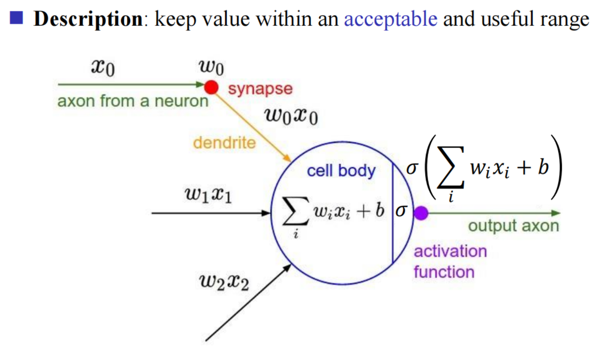

激活函数的特点：**非线性**并且**连续可导**

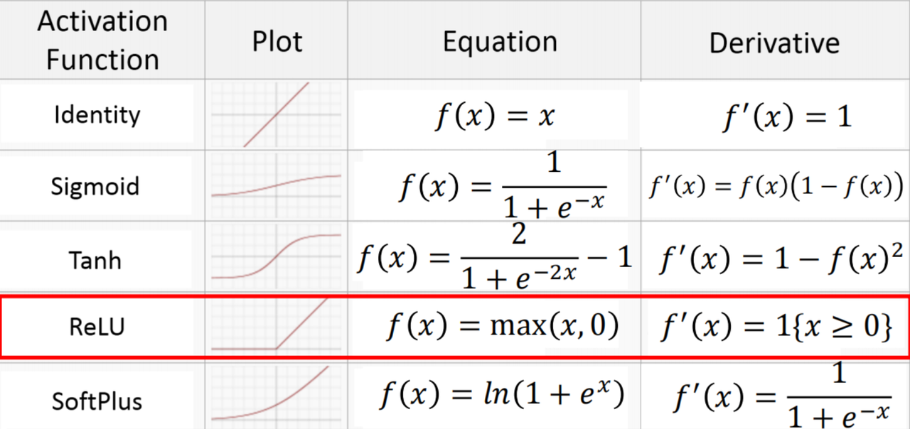

Shiyu Liang 在 2017 年提出了函数逼近原理：如果要达到同等精度的函数逼近/拟合的话，那么更加浅的神经网络需要指数级别的更多神经元。从而更加难以训练。

因此，为了高效地模拟函数，我们的可以建立参数更少的深层神经网络。（层层累叠）

神经网络具有以下三种定律，但是这三种定律的基石都是**矩阵运算**：

① 神经网络是线性可计算的

② 神经网络适用于解决非线性问题

③ 神经网络有堆叠特点，易于编程


## 三、前向传&#x64AD;**（必考，求损失）**

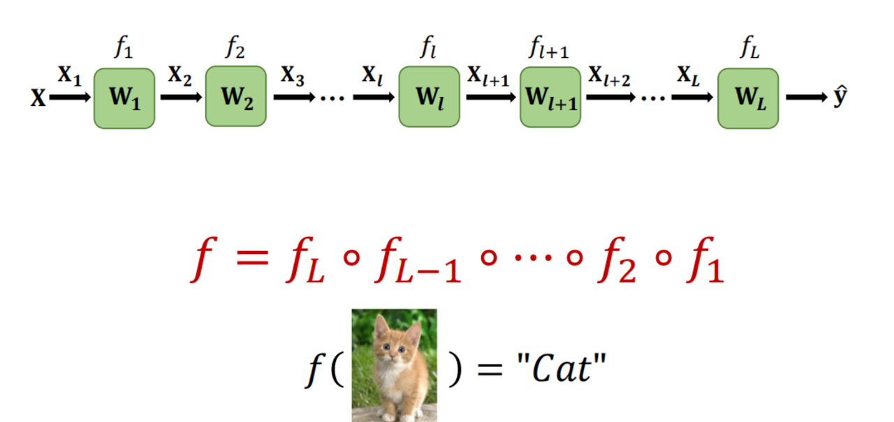

哇，猫猫好可爱啊，想知道电脑是怎么识别猫猫的吗？

在开始前向传播之前，先打开高数课本

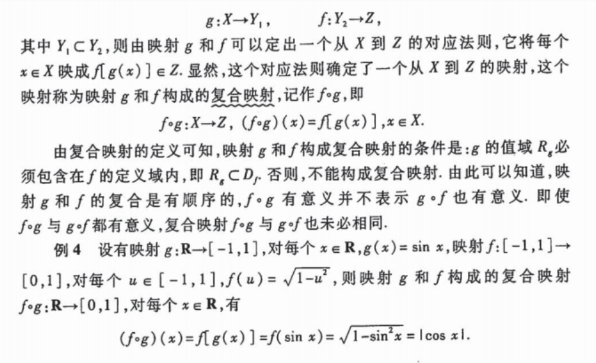

太好了，是清晰明了的高数课本，我们有救啦，前向传播就是复合映射的实际应用：

.png>)

一句话讲完：**上一个节点的输出，就是下一个节点的输入。**

### 加大难度怎么考？

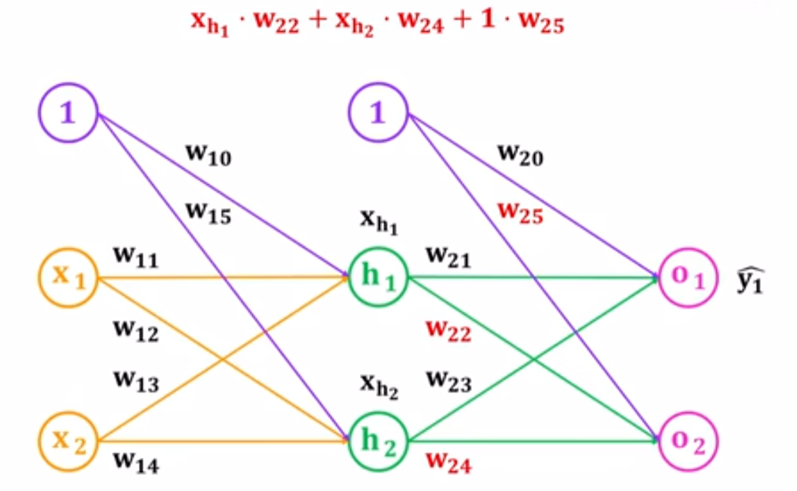

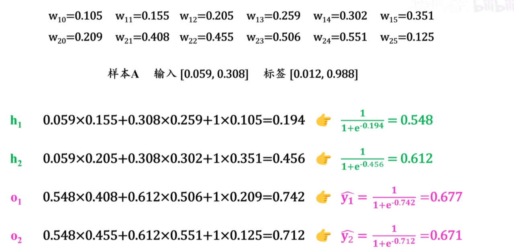


## 复习：Loss Function

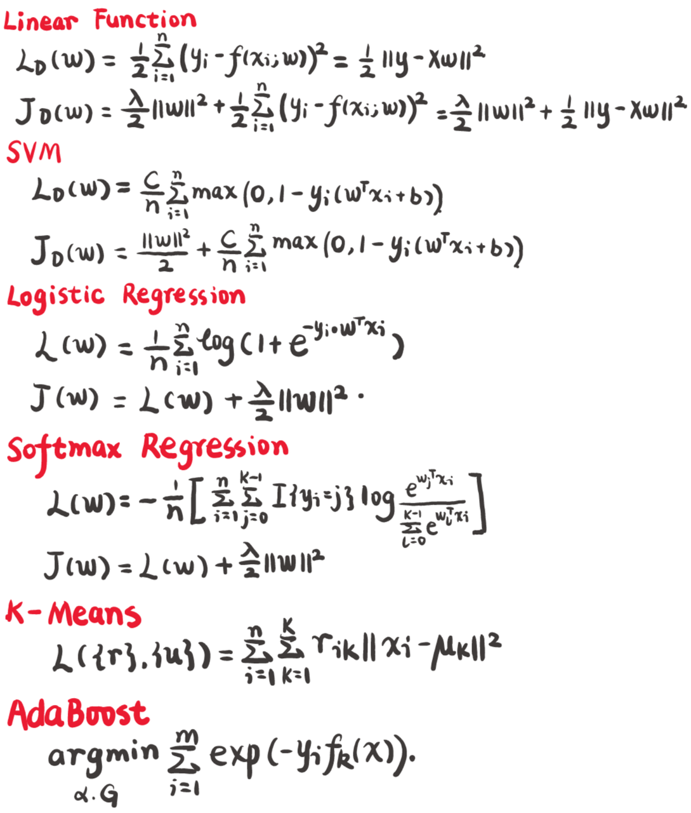

## 四、反向传播（求梯度）

既然我们已经知道了前向传播就是逐层传播、封装堆叠的话，灵魂拷问：我们究竟如何学习到模型的参数 Wl 呢？

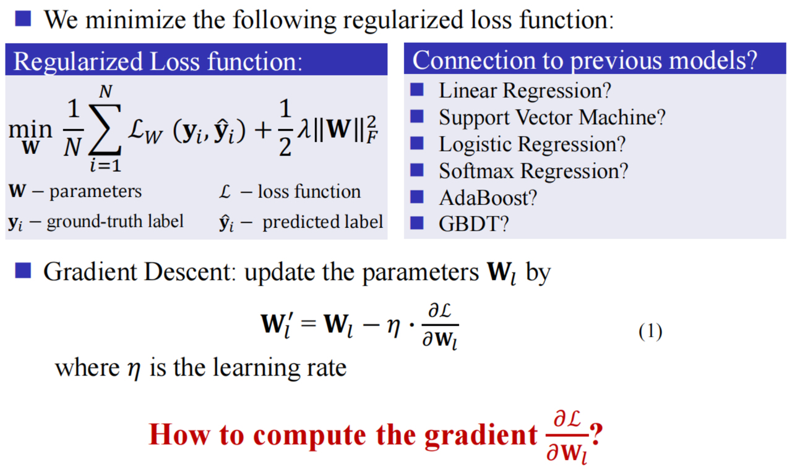

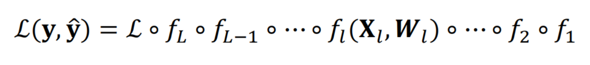

直接去计算梯度是很难的！我们需要使用高数学过的 **链式求导法则** 简化计算：

**单变量的复合函数求导法则：**

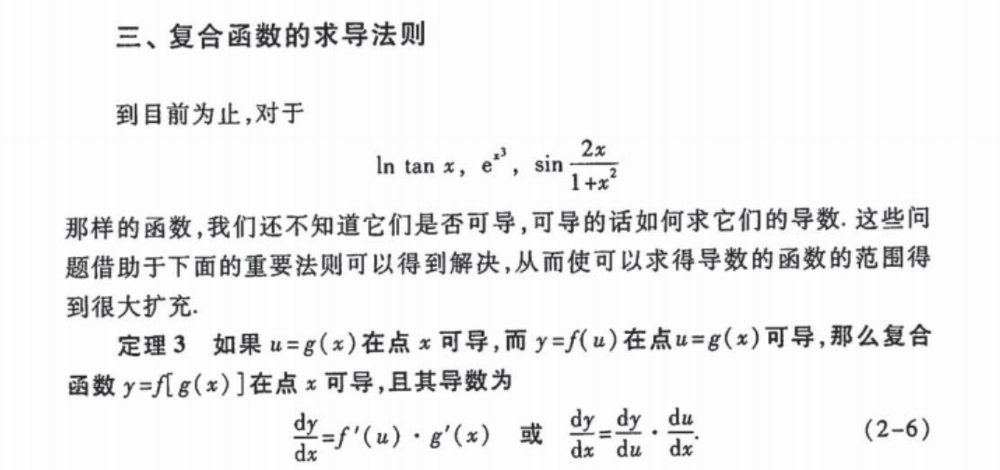

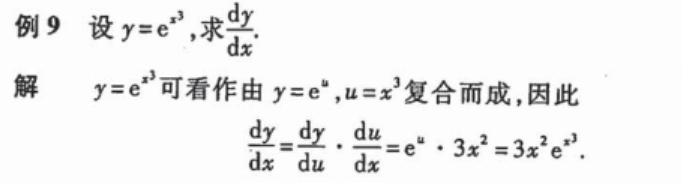

**多变量的复合函数求导法则：**

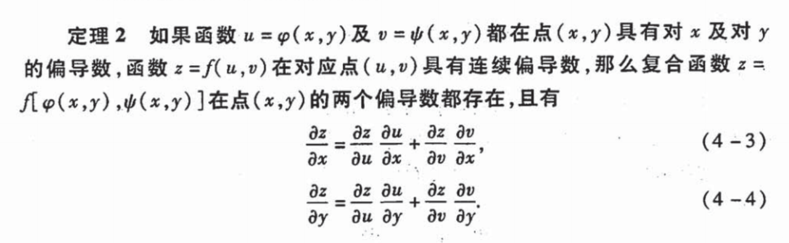

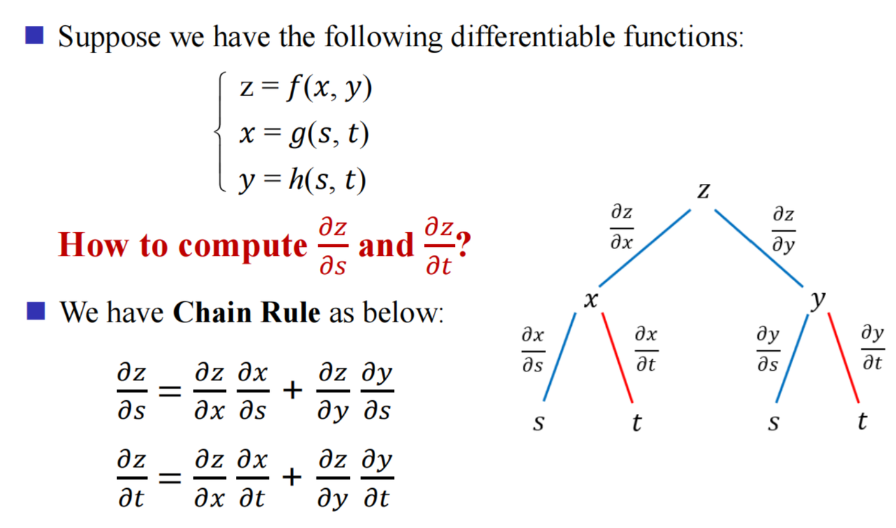

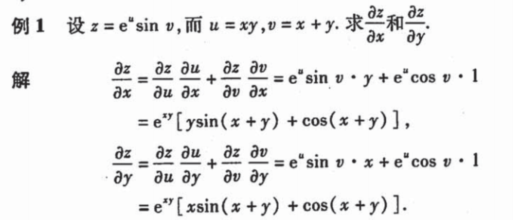

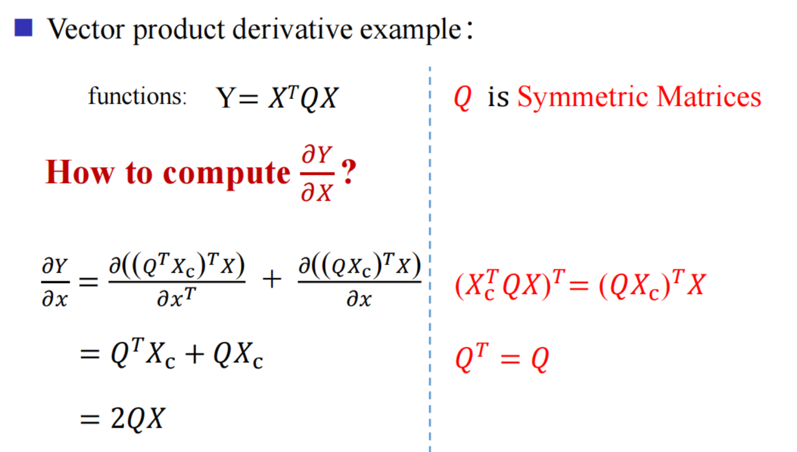

从高数课回来，咱们来推导以下神经网络的梯度计算吧：

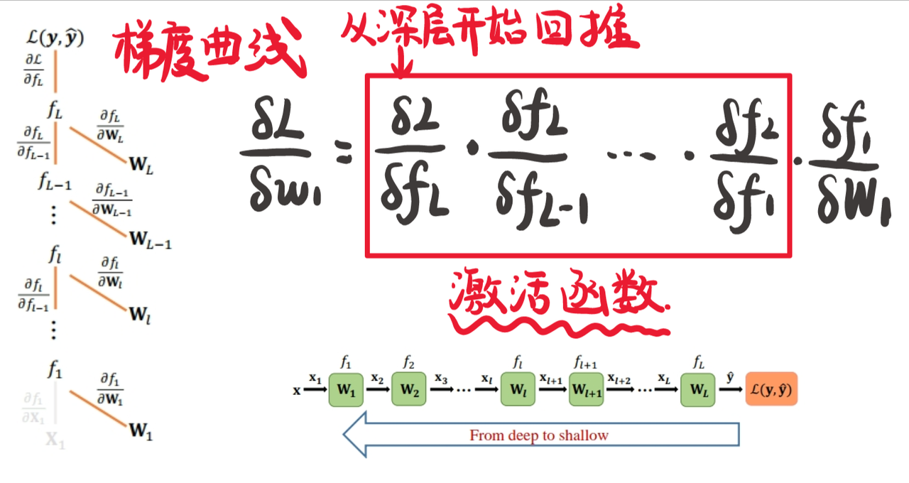

这种链式法则的式子确实解决求导问题了，但是还有两个问题等待解决：

首先，如果求的是对某一层的 w 的值，难道我还要从头开始写一遍吗？

其次，这么长的式子难道我写论文要拷贝上去？

NO！了解动态规划以及数学归纳法的同学可以看出这种有明显规律的式子是可以简化的：


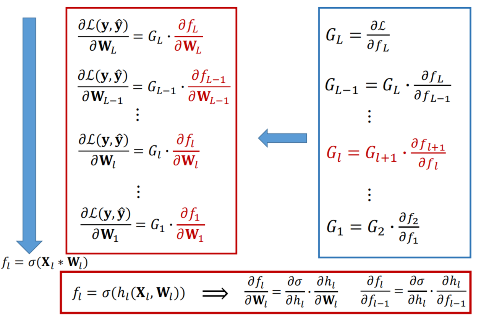

反向传播将损失从最后一层开始计算，计算到第一层为止，每一层计算梯度。

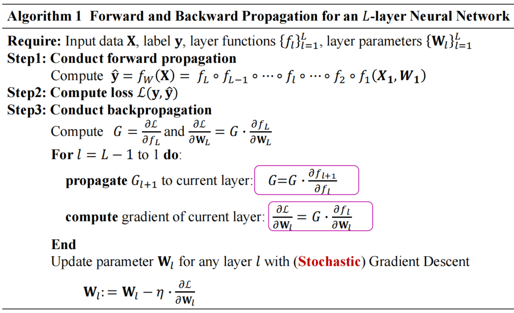

### Pytorch 完整地实现前向和反向传播

```python
import torch
import torch.nn as nn
import torch.optim as optim

# 定义一个简单的前馈神经网络
class SimpleNN(nn.Module):
    def __init__(self, input_size, hidden_size, output_size):
        super(SimpleNN, self).__init__()
        self.fc1 = nn.Linear(input_size, hidden_size)  # 输入到隐藏层的全连接层
        self.relu = nn.ReLU()  # ReLU激活函数
        self.fc2 = nn.Linear(hidden_size, output_size)  # 隐藏层到输出层的全连接层

    def forward(self, x):
        x = self.fc1(x)         # 输入数据通过第一个全连接层
        x = self.relu(x)        # 激活函数ReLU
        x = self.fc2(x)         # 通过第二个全连接层得到输出
        return x

# 创建网络实例
input_size = 3  # 输入特征的大小
hidden_size = 5  # 隐藏层的神经元数目
output_size = 2  # 输出层的神经元数目（假设是二分类问题）

model = SimpleNN(input_size, hidden_size, output_size)

# 定义损失函数和优化器
criterion = nn.CrossEntropyLoss()  # 用于分类任务的交叉熵损失函数
optimizer = optim.SGD(model.parameters(), lr=0.01)  # 使用随机梯度下降优化器

# 模拟一些随机数据作为输入
x = torch.randn(1, input_size)  # 随机生成一个输入数据，形状为 (1, input_size)
y = torch.tensor([1])  # 假设目标类别为1（例如，二分类问题中的标签）

# 查看输入和目标标签
print("输入数据:", x)
print("目标标签:", y)

# 训练过程：前向传播 + 计算损失 + 反向传播 + 更新参数
for epoch in range(100):  # 训练100轮
    # 前向传播
    output = model(x)  # 将输入传入模型进行前向传播
    loss = criterion(output, y)  # 计算损失

    # 反向传播
    optimizer.zero_grad()  # 清除上一轮的梯度
    loss.backward()        # 计算当前轮次的梯度

    # 更新参数
    optimizer.step()       # 使用优化器更新网络参数

    if (epoch + 1) % 10 == 0:  # 每10轮打印一次损失
        print(f"Epoch [{epoch+1}/100], Loss: {loss.item():.4f}")

# 最后打印训练后的模型输出
print("最终输出:", model(x))
```

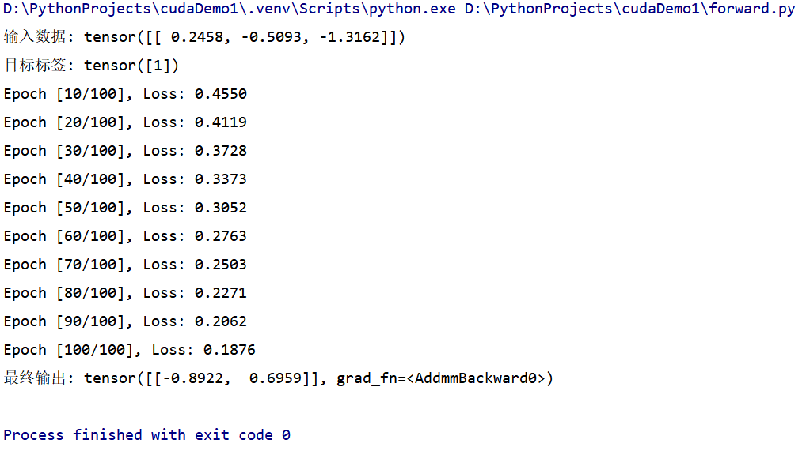

至此，让我们对三种训练方法做一个总结吧

<table>
<thead>
<tr>
<th>方法</th>
<th>好处</th>
<th>不足</th>
</tr>
</thead>
<tbody>
<tr>
<td>梯度下降 GD</td>
<td><ol>
<li>寻找方向精准</li>
<li>适合并行处理</li>
</ol></td>
<td><ol>
<li>收敛速度过慢</li>
<li>大数据内存大</li>
</ol></td>
</tr>
<tr>
<td>随机梯度下降 SGD</td>
<td><ol>
<li>每一步处理廉价</li>
<li>适合处理大数据</li>
</ol></td>
<td><ol>
<li>更多的步骤</li>
<li>不稳定</li>
<li>难以并行处理</li>
</ol></td>
</tr>
<tr>
<td>小批次梯度下降 MBGD（学术界几乎唯一的方法）AdamAdamGrad详情请移步吴恩达</td>
<td><ol>
<li>比 GD 收敛更快</li>
<li>比 SGD 更新更精确</li>
<li>适合并行</li>
<li>适合处理大数据</li>
</ol></td>
<td><ol>
<li>需要新增一个参数 learning-decay 去减少学习率</li>
<li>比 GD 更不稳定</li>
</ol></td>
</tr>
</tbody>
</table>

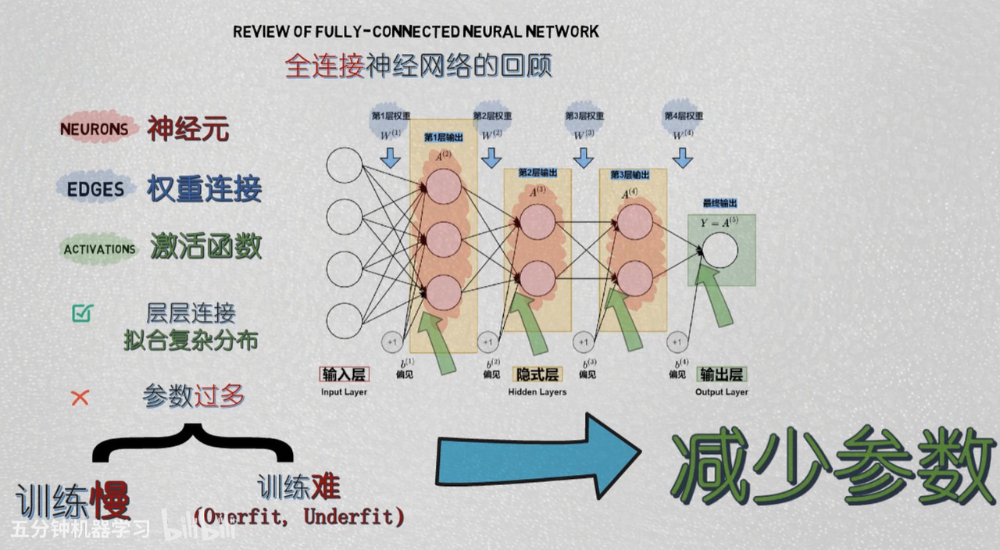

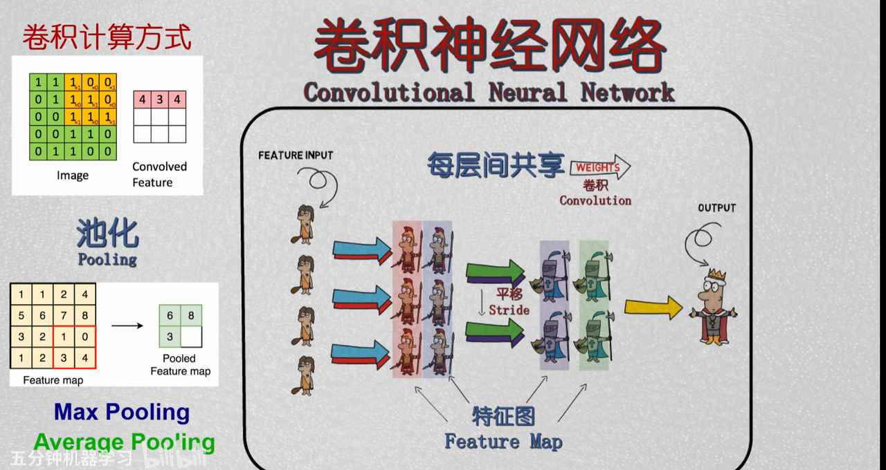

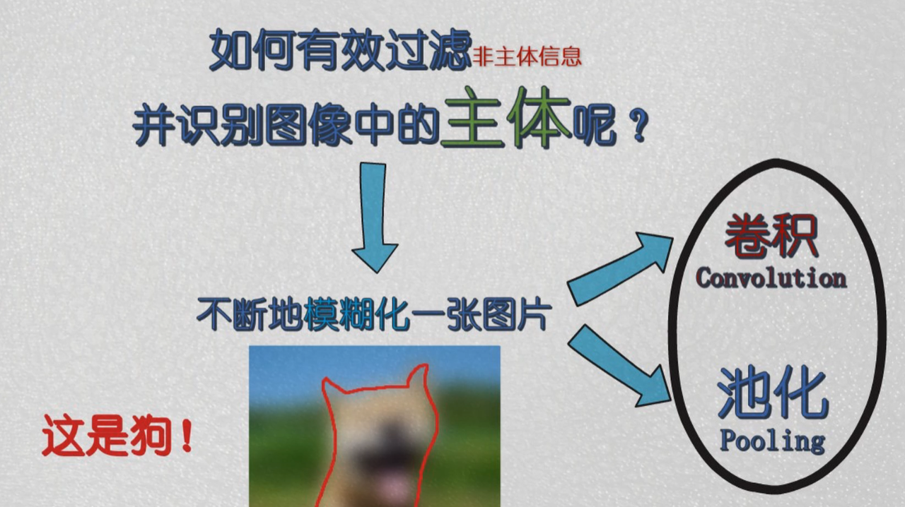

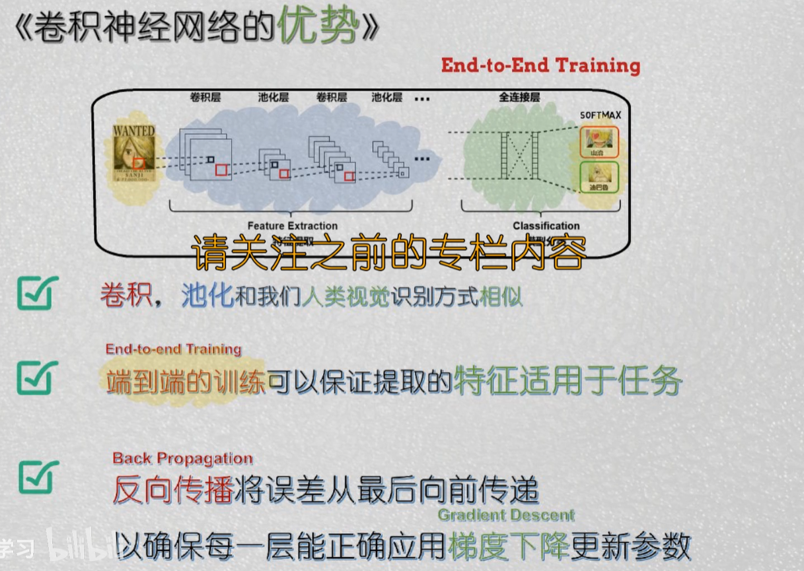

## 五、CNN（必考，卷积神经网络）

这不是 Fake News！是 Convolutional Neural Networks 的缩写！

为什么我们需要卷积神经网络解决图像处理的问题呢？

因为如果还是像此前我们介绍的方法使用前向传播和反向传播的话，那么过多连接会导致感知能力减弱，从而提高了计算复杂度！（连接太多了）

同时，传统的神经网络是无法处理图像处理的三种情况的：

① 连接过多怎么提取特征？

② 图像平移了怎么保持信息不变？

③ 图像有污渍怎么保持信息不变？（也叫做噪声不变性）

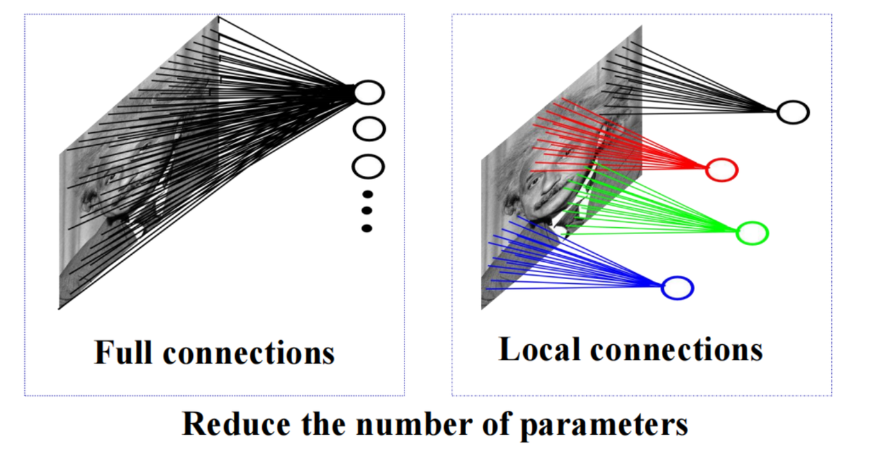

因此，科学家使用了引入了局部连接的概念，这个概念经久不衰，有助于解决平移不变性问题。减少的参数的数目。

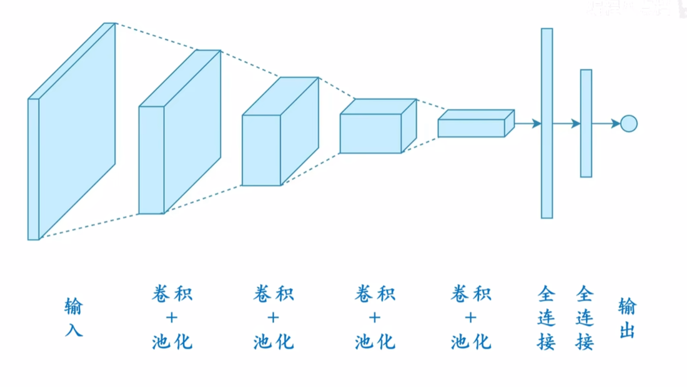

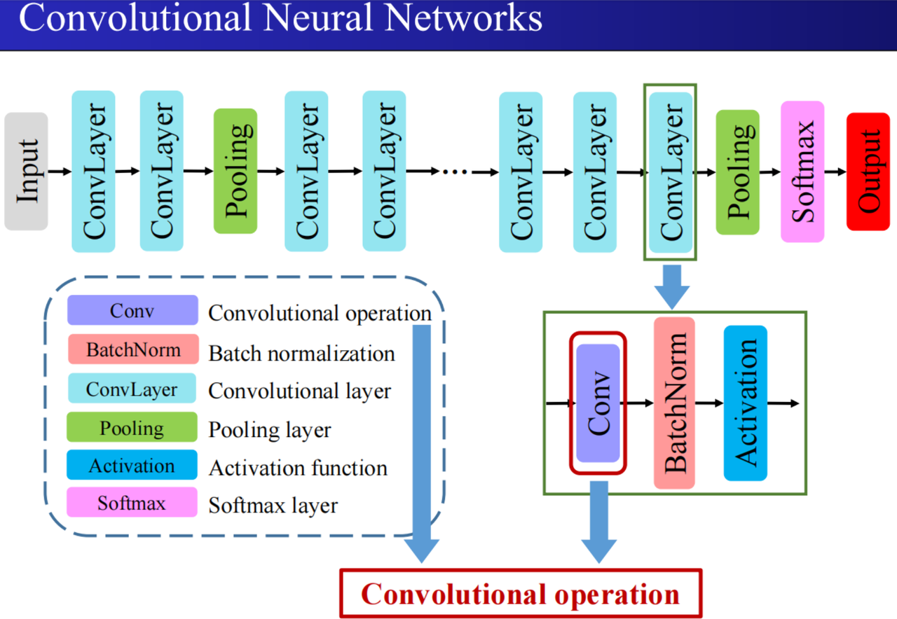

### 步骤①：卷积操作

Filter 英文官方的名称是滤波器，但是我们老师给了一个形象的外号 —— 手电筒。意味着以前我们希望一个闪光灯就可以照出照片的全部信息，现在我们把一个闪光灯改成了多个手电筒，每个手电筒只关注图片的某一块信息，我们训练模型就简化成训练手电筒的问题了。

正式定义：滤波器（也叫做核）是一个矩阵，这个矩阵里面的值被称为权重。这个矩阵可以用于检测特定的特征（描述特定的空间）。

卷积操作有一点点像图形压缩，我们通过数据和核心将图片的信息进行压缩

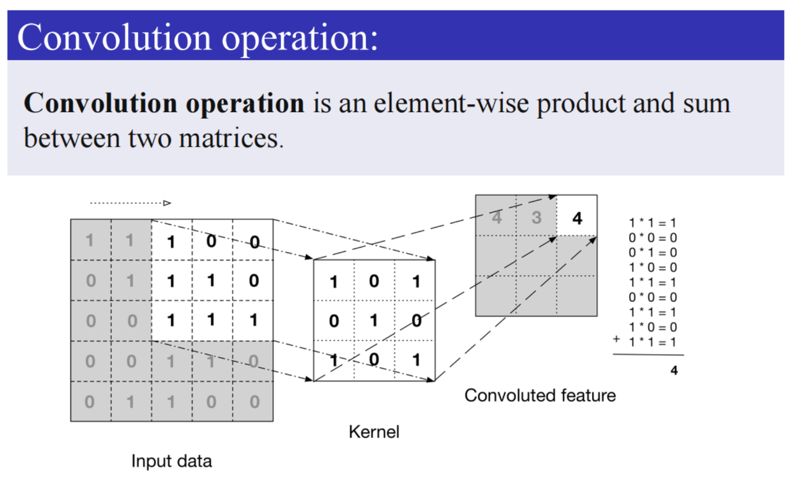

这里有一个小细节：奇数维度的矩阵核心一般是奇数，偶数维度的矩阵核心也一般是偶数。

如果我们还想继续降维的话，可以这么做：

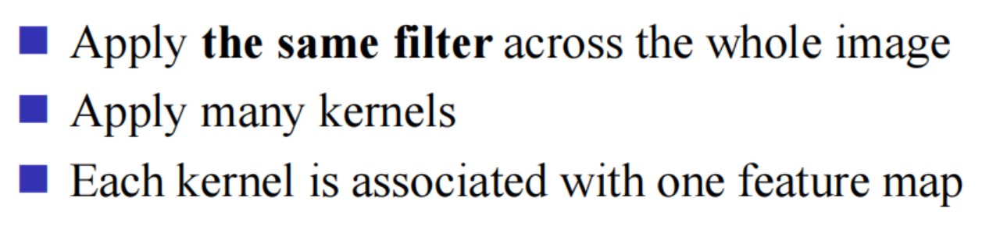

### 2024 必考：手算 Convolution Layer Operation

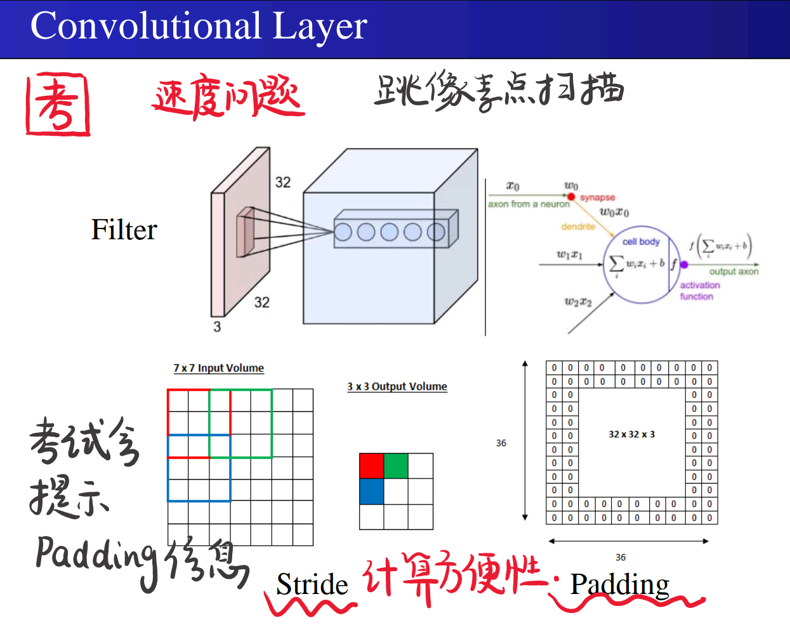

为什么卷积操作需要用 Stride 和 Padding？

卷积操作是深度学习中用于图像处理和特征提取的关键操作之一。在卷积神经网络（CNN）中，卷积层通过 Filter（卷积核）在 Input data（如图像）上进行扫描，以提取局部特征。Stride（步长）和Padding（填充）是卷积操作中的两个重要参数，它们对卷积层的输出尺寸和特征提取过程有着重要影响：

1. **Stride（步长）**：

   * **定义**：Stride是卷积核在输入数据上滑动时的步长。**如果步长为1，卷积核每次移动一个像素；如果步长为2，卷积核每次移动两个像素。**

   * **作用**：

     * 控制输出特征图（feature map）的空间维度。步长越大，输出的特征图尺寸越小，因为卷积核覆盖的区域更广。

     * 减少计算量。步长增加可以减少卷积核需要覆盖的区域，从而减少乘法和加法操作的次数。

     * 影响感受野。步长增加可以增加卷积层的感受野，即**每个输出特征图上的点可以“看到”输入数据的更大区域。**

2. **Padding（填充）**：

   * **定义**：Padding是在输入数据的边界添加的额外像素，通常填充为0（零填充）。

   * **作用**：

     * 控制输出特征图的空间维度。通过添加填充，可以保持输入和输出特征图的尺寸相同，或者根据需要调整输出尺寸。

     * 影响感受野。填充可以增加卷积核覆盖的区域，从而增加感受野，使得卷积层能够捕获到输入数据边缘附近的特征。

     * 防止边缘效应。没有填充的情况下，边缘区域的信息可能不会被充分捕获，因为卷积核无法完全覆盖边缘区域。填充可以减少这种边缘效应，使得边缘信息也能得到有效利用。

   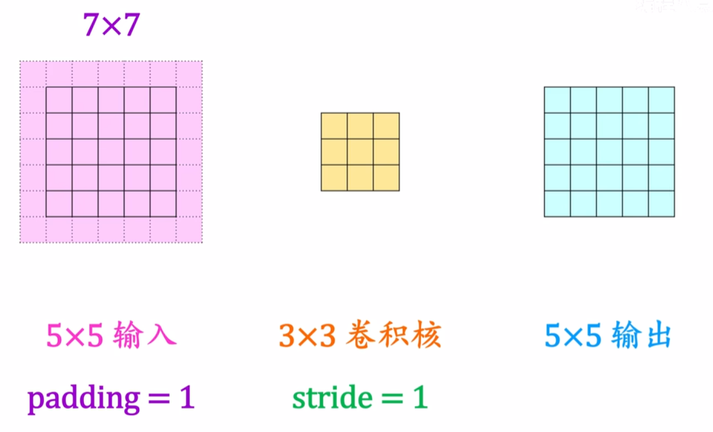

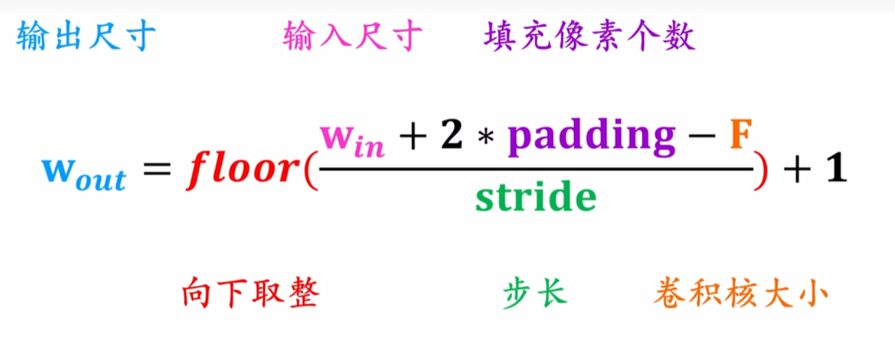

总结来说，Stride和Padding是调整卷积操作输出尺寸和优化特征提取过程的重要工具。它们允许我们控制卷积层的输出特征图的尺寸，以及调整卷积层的感受野和边缘效应，从而在不同的应用场景中实现最佳的性能。

#### 容易踩坑：这里的乘法怎么做？

* **`dot`**：适用于点积和矩阵乘法的场景，涉及到矩阵的乘法运算，通常会有维度上的匹配要求。

* **`multiply`**：适用于逐元素的运算（Hadamard积），计算两个数组在相同位置上元素的乘积，维度必须相同。

#### 在 PyTorch 中的使用

PyTorch 中 `torch.matmul` 相当于 `dot`（用于矩阵乘法或向量点积），而 `*` 或 `torch.mul` 用于逐元素乘法（`multiply`）。

```python
import torch

# 向量点积
a = torch.tensor([1, 2, 3])
b = torch.tensor([4, 5, 6])
result_dot = torch.dot(a, b)  # 结果是 32
print(result_dot)

# 向量逐元素乘法
result_multiply = a * b  # 结果是 [4, 10, 18]
print(result_multiply)

# 矩阵乘法
A = torch.tensor([[1, 2], [3, 4]])
B = torch.tensor([[5, 6], [7, 8]])
result_matrix = torch.matmul(A, B)  # 结果是 [[19, 22], [43, 50]]
print(result_matrix)

# 矩阵逐元素乘法
result_matrix_multiply = A * B  # 结果是 [[5, 12], [21, 32]]
print(result_matrix_multiply)
```

### 期末怎么考计算题？

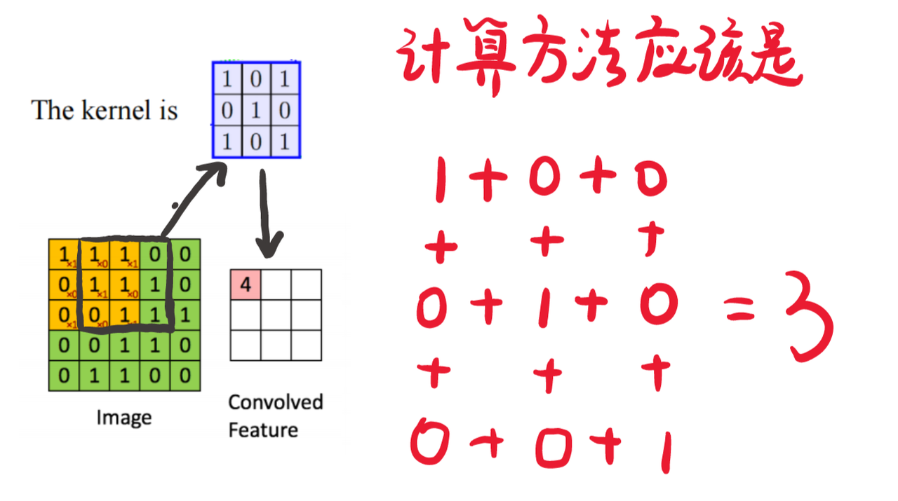

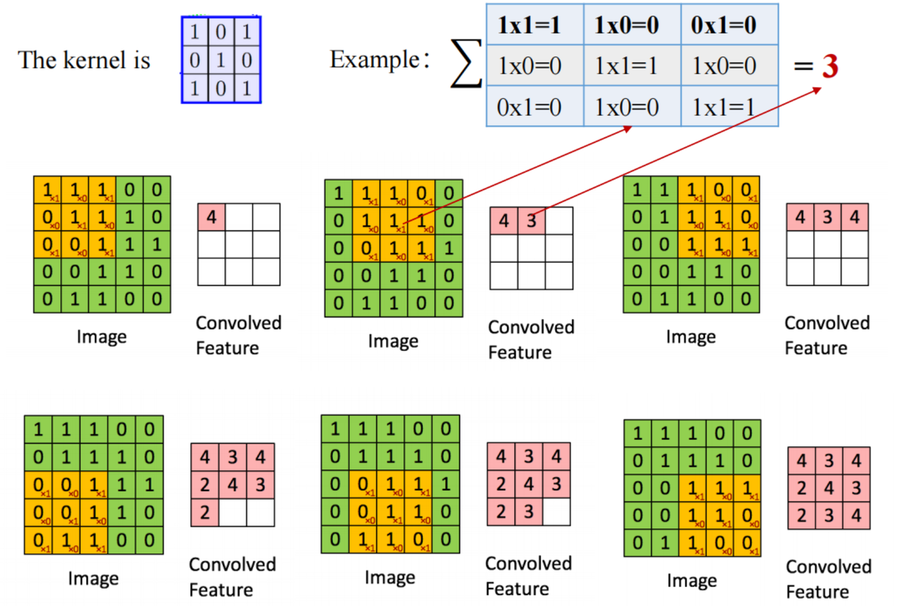

为什么使用本地连接和参数共享呢？

因为有一些特征在图片里面很不起眼，但是发挥了很重要的作用，比如说知更鸟的嘴。

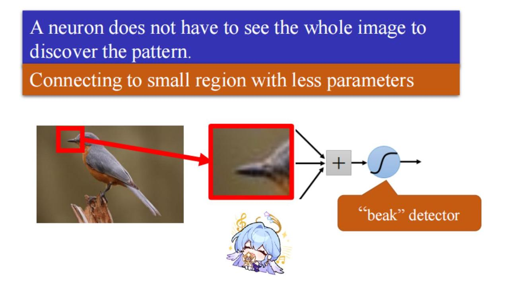

不同类别的鸟的鸟嘴都可以使用相同的过滤器进行处理，提高效率。

不同的 filter 对图片的影响也不同，类似于 P 图。

以前需要专家辛辛苦苦设计特征的工作，现在我们可以通过网络自行提取了✅

### 步骤②：批归一化（面试考，期末不考）

在概率论与数理统计中，我们学过如何将一般形式的正态分布转化为 0-1 正态分布。归一化的思想在机器学习领域非常重要，一定要重视归一化操作！


**内部协变量偏移（Internal Covariate Shift）**：指的是在训练过程中，由于网络参数更新导致输入分布发生变化，这会使得训练变得不稳定。（面试会考！）

**特征归一化（Feature Normalization）**：是一种技术，通过标准化每层的输入（例如，均值为0、方差为1），减少分布变化对训练的不良影响，从而加速训练过程并提高稳定性。


```python
import torch
import torch.nn as nn

# 创建一个简单的模型，包含一个批归一化层
class SimpleModel(nn.Module):
    def __init__(self):
        super(SimpleModel, self).__init__()
        self.fc1 = nn.Linear(10, 20)
        self.bn1 = nn.BatchNorm1d(20)  # 批归一化层
        self.fc2 = nn.Linear(20, 2)

    def forward(self, x):
        x = self.fc1(x)
        x = self.bn1(x)  # 应用批归一化
        x = torch.relu(x)
        x = self.fc2(x)
        return x

# 创建模型实例
model = SimpleModel()

# 创建一个随机输入张量
input_tensor = torch.randn(5, 10)  # 假设批量大小为5，输入特征为10

# 前向传播
output = model(input_tensor)
print(output)
```

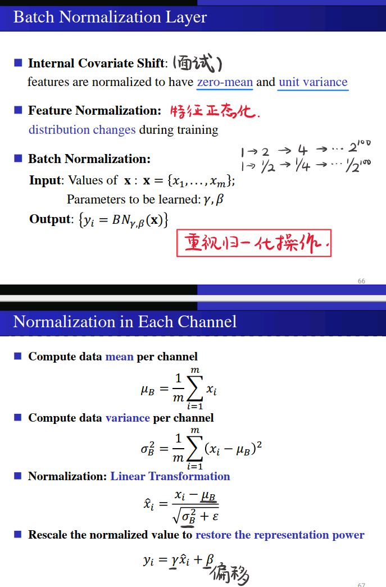

使用了批归一化，**数据会变得相对稳定**

### 步骤④：Pooling Layer 池化层（能提升平移不变性）

平均池化：提取平均值（保留背景信息）

最大池化：提取最大值（突出关键信息）

在之前得到的矩阵中，我们甚至可以只选取特定的值，让矩阵变得更小！

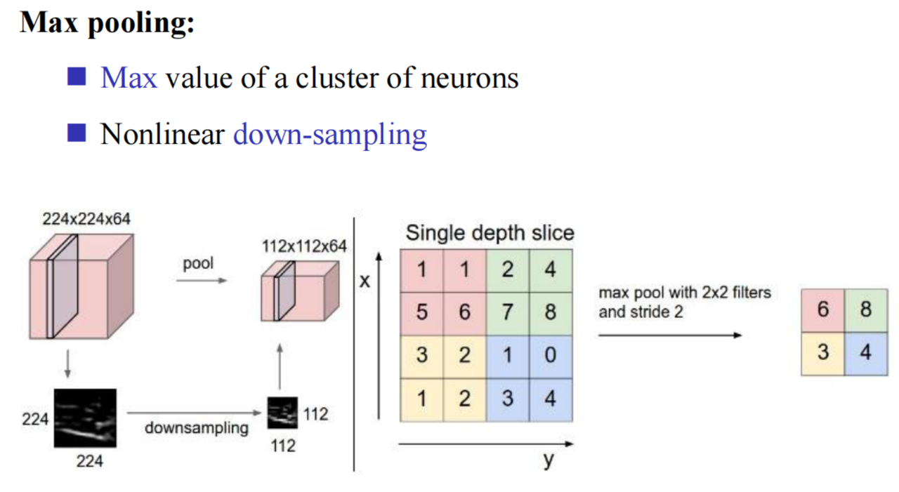

通过这一种方法可以得到 Residual Network，引入了残差学习的概念

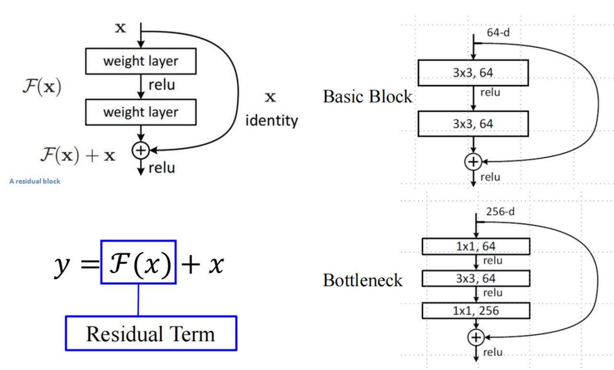

### 步骤⑤：激活函数

我们在神经网络的介绍中已经提及了激活函数，老师介绍了 ReLU 和 Softplus 两种函数：

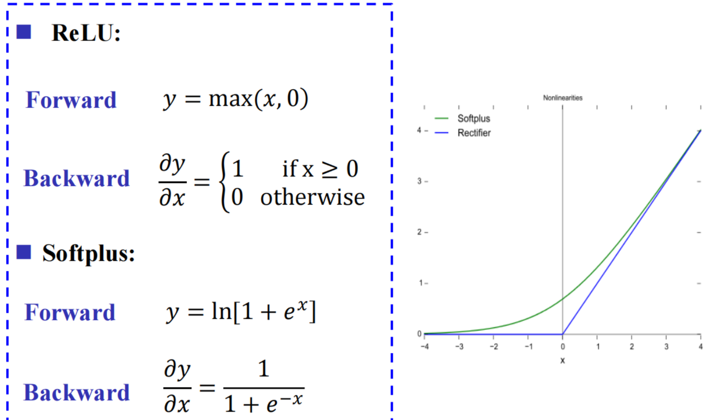

同时，基于 ReLu，我们也有一种修改斜率的 Leaky ReLU

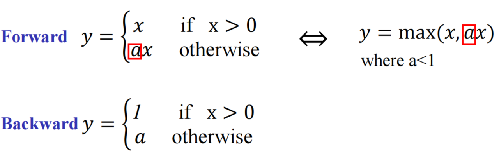

## CNN 的前向传播和反向传播

```python
import torch
import torch.nn as nn
import torch.optim as optim
import torchvision.transforms as transforms
from torchvision import datasets
from torch.utils.data import DataLoader

# Define the CNN architecture
class SimpleCNN(nn.Module):
    def __init__(self):
        super(SimpleCNN, self).__init__()
        self.conv1 = nn.Conv2d(1, 32, kernel_size=3, stride=1, padding=1)  # Input: 1 channel (e.g., grayscale)
        self.conv2 = nn.Conv2d(32, 64, kernel_size=3, stride=1, padding=1)
        self.fc1 = nn.Linear(64 * 7 * 7, 128)  # Assuming input images are 28x28
        self.fc2 = nn.Linear(128, 10)  # 10 classes for output

    def forward(self, x):
        x = nn.functional.relu(self.conv1(x))
        x = nn.functional.max_pool2d(x, kernel_size=2, stride=2)
        x = nn.functional.relu(self.conv2(x))
        x = nn.functional.max_pool2d(x, kernel_size=2, stride=2)
        x = x.view(-1, 64 * 7 * 7)  # Flatten the tensor
        x = nn.functional.relu(self.fc1(x))
        x = self.fc2(x)
        return x

# Set device (CPU or GPU)
device = torch.device("cuda" if torch.cuda.is_available() else "cpu")

# Instantiate the model
model = SimpleCNN().to(device)

# Define a loss function and optimizer
criterion = nn.CrossEntropyLoss()
optimizer = optim.Adam(model.parameters(), lr=0.001)

# Data loading
transform = transforms.Compose([transforms.ToTensor()])
train_dataset = datasets.MNIST(root='./data', train=True, download=True, transform=transform)
train_loader = DataLoader(train_dataset, batch_size=64, shuffle=True)

# Training loop
num_epochs = 5

for epoch in range(num_epochs):
    for images, labels in train_loader:
        images = images.to(device)
        labels = labels.to(device)

        # Forward pass
        outputs = model(images)
        loss = criterion(outputs, labels)

        # Backward pass and optimization
        optimizer.zero_grad()  # Clear previous gradients
        loss.backward()        # Backpropagation
        optimizer.step()       # Update weights

    print(f'Epoch [{epoch + 1}/{num_epochs}], Loss: {loss.item():.4f}')

print("Training complete.")
```

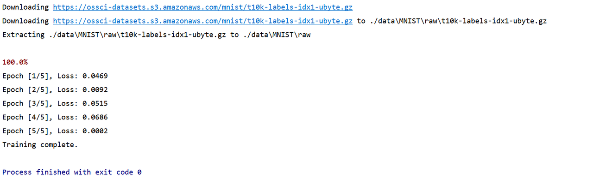


# 第十二章 顺序建模方法及其应用：以 RNN 为例

## 序、[编程八点档 RNN 27 \~ 29](https://www.bilibili.com/list/1056179587?sort_field=pubtime\&spm_id_from=333.999.0.0\&oid=1155878984\&bvid=BV1pZ421M7Ft)


G-O-O-G-L-E 咕噜咕噜！


&#x20;


## 一、背景知识

序列建模是对任何类型的序列数据（例如音频、文本等）进行建模、解释、预测或生成的任务。

自动生成是用于预测什么词或者字母会出现在下一个。

挑战：输入和输出都有顺序依赖，换句话说，当前的输出依赖于之前的输入（为啥不用CNN？）


如何预测顺序的单词的 likelihood（可能性）？使用条件概率！


对源语言进行编码，x\[1], ... , x\[T]

输出就是目标句子：y\[1], ... , y\[T]

编码器：用于将源语言编码成文本矩阵的语言模型

解码器：一种从文本矩阵顺序第生成目标语言的语言模型

语音识别：将口语转化为可以阅读的文本

难点：如果语音含有令人疑惑的单词，那么难以确定是什么词。经典的就是“黑化肥会挥发”。

机器翻译：将一门语言的文本翻译成另一门语言的文本

难点：一个词语，多个含义。或者语法不一致。

专有名词识别：在进行翻译之前，可以把专有名词实现定位并提取出来

难点：设计模型来处理复杂的语言环境。


视频捕捉：从视频中获取文本描述

难点：参数固定，但是视频长度不固定啊

## 二、RNN（循环神经网络）

RNN 在时间维度记忆信息的层面表现优异。


一个 RNN 模型可以被认为是一系列相同网络的拷贝，每一个网络将信息传递给 successor（继任者）


语言建模指的是已知文本，预测下一个单词，有一点像完形填空。

我们已知一个单词序列，就可以通过下面的公式推导出来：


如果我们希望建模效果好，就需要考虑很多单词。

以下是 RNN 训练过程的表示：


RNN 有一个问题：long-term dependencies。翻译过来就是长周期的依赖。

口语表达：词语相互距离越远，则相互之间的依赖越少。

公式化表达：


这种依赖存在的问题是：由于矩阵乘法，权重会出现 vanish or explode（减少或者蒸发）的情况，在隐藏的状态路径中，很多操作就难以去捕获了。

举个例子：XX 是（XX 国最尊重 XX 的在 X 站直播的虚拟 XX ）主播

**打括号的一长串内容和宾语主播无关**

## 三、注意力机制

总结一下之前提到的 long-term dependencies ：翻译效果会随着文本的增长而出现快速的损失消退

引出问题：我们能不能将所有有必要的源语句信息压缩成一个固定的，静态的文本向量 c 呢？

在解码器的每一步，开发者可以使用对编码器的**直接连接**让解码器专注于源语言的某一个特定的部分。

.png>)

为什么要引入注意力机制呢？老师通过拟合正弦函数的例子跟大家说明了，在有些情况下，使用线性模型、平均值来拟合效果是不好的！而如果我们将点分成一个一个类别，每一个类别用一种加权线性函数拟合，最后再加起来，是不是就能解决这个问题呢？（这体现了化曲为直的数学思想）

.png>)

也就是说，咱们将 α 转化为了 softmax 函数？✅

注意力池化层可以是含参的，也可以是不含参数的，那就会产生两种 α 的求解方法，如图所示：


含参数的注意力机制可以让模型的注意力更加集中，但是**有可能会出现过拟合**的现象。

注意力机制的核心观点：

① 注意力池化层可以是含参的、也可以是不含参的

② 在注意力池化层中，每一个值都有权重与之对应，公式表示如下所示：

### Pytorch 实现注意力机制

#### Additive Attention


#### Scaled Dot-Product Attention


接下来介绍了注意力机制在图片、视频、机器识别的应用，并且介绍了部分变体，大家了解即可✅

## 四、Transformer（你所需要的就是注意力）

NMT 神经机器翻译：一种使用人工神经网络去预测词语顺序出现可能性的机器翻译方法


如何预测词语顺序出现的可能性？

Input: encode of the source sentence x\[1], ... , x\[T] 输入：编码源句子

Output: generate target sentence y\[1], ... , y\[T] 输出：生成目标句子

在此前的讨论中，我们已经学习了 Encoder-Decoder 的相关概念，并且通过一个例子解释了为什么长句子会出现梯度消失的问题。Self-Attention in Transformer 可以通过计算单词之间的直接联系来解决我们在上一节注意力机制提到的因为单词过长导致无法衔接的问题。


编码器的输入首先流经 self-attention layer

当它编码特定的单词时，它会关注其它单词。

在 self-attention layer 和 feed forward neural network 之间有一个向量 z 作为传输，如何得到向量呢？

① 从编码者输入的向量中创建 query key value 的向量

② 计算每一个单词之间的分数（分数决定了注意力的分布）

③ 把分数开 N 次方，N 就是 key 向量的维度

④ 使用 Softmax 实现归一化，保证分数都是正数，且加起来和为 1

⑤ **Multiply 每一个 value 向量 和 Softmax 分数。高分的 value 提高注意力，低分的 value 丢弃**

⑥ 将加权的 value 向量接起来，产生 self-attention 输出

图解六步走：


请注意，transformer 一定需要嵌入位置，对于文字处理来说，位置是很重要的，但是 transformer 在没有特别指明的情况下会忽略位置信息，导致错误：

即使她**不**能去大厂，她也很满足。

即使她能去大厂，她也很**不**满足。


在 RNN 中，词语是一个一个传递进去的，顺序信息很明显，但是在 Transformer 中，**所有的词语会同时被推入并且处理。因此，需要新增一个层：Positional Encoding Layer（位置编码层）—— 编码了位置信息，为输入嵌入位置信息。**

这一层无需修改 Transformer 的架构，有助于提高效率。


为了接入位置信息，每一个位置都有一个独特的位置向量（不是从数据中学来的）。

i 表示位置，j 表示维度，位置编码的维度应该和词语的嵌入相同。


为什么奇数位置用 sin？偶数位置用 cos？

根据高中数学学过的三角函数的知识：

.png>)


# 第十三章 强化学习与策略梯度方法

## 序、ChatGPT 的底层原理（必考）

人工智能需要模仿人类的哪三个能力？感知、表示、预测（规划/决策/控制）


老师上课的时候用带娃来举例子：

第一阶段：监督训练（孩子 0 — 3 岁） 父母是孩子的第一任老师

第二阶段：奖励模型训练（孩子 3 — 12 岁） 做得好有奖励，做不好有惩罚

第三阶段：强化学习模型训练（12+）自我学习，自我探究

## 一、强化学习介绍（必考）

强化学习指的是让模型学会解决顺序指定决策问题。


在每一步 t 的时候，智能体都会做三件事：通过观察得出初步结论 — 行动 —— 得到正负反馈

环境：获得行动 — 释放奖励/惩罚 — 释放观察（我个人倾向于翻译成场景）

我们将这一系列活动进行总结，可以发现，**每一个状态都是由之前的决策决定的**


Agent 做事情的目的是让**总的未来奖励最大化（未来回馈的综合最大）设置合适的 Reward 很重要**


强化学习和其他方法的不一样之处：

① 没有监督者，只有奖励信号

② 反馈是延迟的，不是即时的

③ 时间真的很重要（连续的、非独立同分布的轨迹数据）

④ 代理的行为会影响它收到的后续数据

## 二、马尔科夫决策过程


智能体会根据它学过的策略去执行一系列行动，我们使用一个条件概率去表示这种现象。

我们可以使用神经网络去表示策略，目标就是让奖励最大化。


我们引入参数 θ 以后，这一种条件概率的输入和输出就清晰了

**输入：**&#x72B6;态 s

**输出：**&#x6BCF;一个对应 neuron 的状态 a


轨迹指的是智能体每一次生成的随机序列（状态，活动和奖励）。

一个轨迹是从一个概率生成的，但显而易见，这种联合概率计算是非常非常困难的。

### 马尔科夫过程

马尔科夫过程将条件概率进行了简化，当前状态已经为未来提供了足够的统计数据支撑了！


**鉴于现在，未来与过去无关。**


状态转移矩阵指的是我们可以将简化的条件概率通过矩阵表示出来，易于可视化和计算：


### 马尔科夫奖励过程

马尔科夫奖励过程 = 马尔科夫链 + 奖励


### 马尔科夫决策过程

马尔科夫决策过程 = 马尔科夫奖励过程 + 行动


**什么是策略（Policy)？**

&#x20;     策略就是已知状态的前提下行动的分布

&#x20;     策略是 agent 智能体的行为模型，可以用神经网络表示。马尔科夫决策过程的策略依赖于当前的状态（而不是历史状态）。

我们学习策略 π(a | s) 的方法就是使未来的报酬（回报）最大化。

**什么是回报（Return）？**

请让我们看看公式的定义


其中，r（伽马）∈ \[0, 1]，这是评估未来回报的 discount factor

这个参数是用来 trade off 立即回报和延迟回报的：

r -> 0，短期回报；r -> 1, 长期回报

为什么我们需要引入这个参数呢？

引入这个参数可以**规避无穷的回报**，从而**规避环形的马尔科夫决策**过程。这个参数也保证了我们**使用动态规划**去处理马尔科夫决策过程时**保持收敛**。

这一张图总结了强化学习的基本任务：


状态-值函数：这个函数描述了从状态 s 出发期待的返回值


这一个引入了动态规划的思想，具体的推导如手绘所示


Bellman equation


Bellman Equation 说明：当前状态的值函数可以通过下一个状态推导出来。

如果是矩阵的推导，如图所示


让我们总结一下马尔科夫决策过程，我们引入了状态-值函数，并且使用了动态规划的方法将公式体现出来：

矩阵求解马尔科夫决策过程：

① 求解逆矩阵的复杂度为 O（N^3），N 表示状态数目

② 矩阵求解法只适用于求解小型的马尔科夫决策过程

③ 模型 P 必须是已知的

迭代方法处理大型的马尔科夫决策过程：


**① 动态规划（Dynamic Programming）**

&#x20;     动态规划是一种通过把原问题分解为相对简单的子问题的方式求解复杂问题的方法。其核心思想是利用“记忆化”或者“表格”来存储中间结果，避免重复计算，从而提高效率。动态规划的关键步骤包括状态定义、状态转移方程和边界条件的确定。

从零开始学习动态规划，先从这里开始吧：[代码随想录-动态规划理论篇](https://www.programmercarl.com/%E5%8A%A8%E6%80%81%E8%A7%84%E5%88%92%E7%90%86%E8%AE%BA%E5%9F%BA%E7%A1%80.html)

想深入理解动态规划的底层原理，算法导论欢迎您：[\[第15集\] 动态规划，最长公共子序列\_哔哩哔哩\_bilibili](https://www.bilibili.com/video/BV1Tb411M7FA?spm_id_from=333.788.videopod.episodes\&vd_source=da1f2d78d73dfaae6ddfbcfe8e4801d8\&p=15)

按照笔者的理解，大家不要被这个词语吓唬了，其实动态规划表用黄瀚老师的讲法，**就是“填表”法。**

**我们不希望计算机重复计算 —> 开辟一个空间（表）专门存储计算的中间结果 —>&#x20;**

**使用状态转移等公式去填表 —> 最后根据需求从表格中直接提取结果，体现了以空间换时间的思想。**

思考题：斐波那契数列是怎么从递归变成动态规划的？请看 Python 代码

```python
# 递归
def fibonacci_recursive(n):
    if n <= 1:
        return n
    else:
        return fibonacci_recursive(n - 1) + fibonacci_recursive(n - 2)


# 动态规划
def fibonacci_dp(n):
    if n <= 1:
        return n
    # 初始化一个数组来存储斐波那契数列的值
    dp = [0] * (n + 1)
    dp[1] = 1
    for i in range(2, n + 1):
        dp[i] = dp[i - 1] + dp[i - 2]
    return dp[n]


# 压缩过的动态规划
def fibonacci_optimized(n):
    if n <= 1:
        return n
    a, b = 0, 1
    for i in range(2, n + 1):
        a, b = b, a + b
    return b
```

**② 蒙特卡洛评估（Monte-Carlo Evaluation）**

&#x20;     蒙特卡洛方法是一种基于随机抽样的算法，用于估计可能的结果分布，常用于解决概率和统计问题。在强化学习中，蒙特卡洛评估用于估计策略的价值函数，**通过模拟完整的行为序列（从初始状态到终止状态）来计算期望回报。蒙特卡洛方法的一个局限性是必须等待整个episode结束之后才能获得返回值**，这导致它在某些情况下效率较低。

**③ 时序差分学习（Temporal-Difference Learning）**

时序差分学习是强化学习中的一种方法，它结合了蒙特卡洛方法和动态规划的特点。时序差分学习可以直接从经验中学习，不需要知道完整的环境模型，同时又能根据已学习到的价值函数的估计进行当前估计的更新，而不需要等待整个episode结束。时序差分学习的核心是利用下一个状态的价值估计来更新当前状态的价值估计，这种更新是基于TD误差（即实际获得的奖励与预期奖励之间的差异）进行的。这种方法使得学习可以在与环境交互的过程中实时进行，提高了学习的效率和灵活性。


## 三、策略梯度算法

在上一节，我们学习了策略的概念，现在再结合概念看这一页内容就好理解了


但是，还有两个概念性的问题需要解决：

首先，什么是目标函数？


目标函数是用于评估策略的质量的辅助函数。

其次，什么是 Trajectory （轨迹） ？


&#x20;**计算机科学**：在数据挖掘和机器学习中，**轨迹可以指数据点在特征空间中的路径或序列。**

我们知道，强化学习的目的就是让奖励最大化，而此前我们解决的绝大部分问题都是最小化问题，我们能不能使用梯度这种工具来加快我们寻找最大值的过程呢？

以下的这种算法就是通过增加梯度，让模型永远往最好的状态走，从而让奖励最大化的


算法的详细推导请感兴趣的同学对照 PPT 完成

期末考到 （第十三章第 38 页） 就基本完结了，剩下的内容请感兴趣的同学自行探究～


# [本章拓展：《动手学深度学习》](https://zh-v2.d2l.ai/)


# 面试鸭

## [机器学习面试题](https://www.mianshiya.com/bank/1821834636175642625)

## [深度学习面试题](https://www.mianshiya.com/bank/1821834656568348674)

## [强化学习面试题](https://www.mianshiya.com/bank/1821834686117220353)

## [Transformer 面试题](https://www.mianshiya.com/bank/1821834692534505473)


# 满纸荒唐言，一把辛酸泪。

