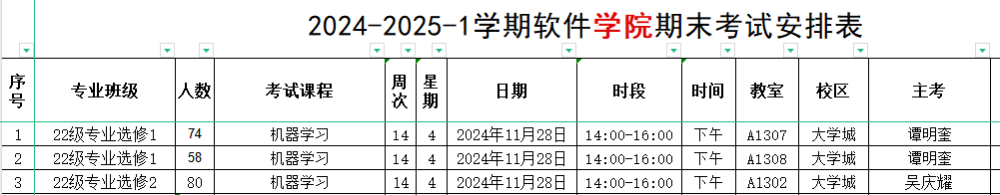

# 期末划重点

## 期末题型

选择题 + 填空题 + 判断题 + **计算题（CNN，Padding, Stride）** + 综合题 + **论述题（15 分！字多分！）**

100 分及格，只要卷面分 20 分，外加上实验报告全交，就是 60 分

## 四次实验做了啥？

[ 2024《机器学习》实验指导书](https://iwen49pt7gl.feishu.cn/wiki/WaadwQDy6iMSF0kRENpcboGUn6d)

第一次实验：线性回归、随机梯度下降算法

第二次实验：逻辑回归、支持向量机

第三次实验：CNN 人脸识别

第四次实验：RNN 中英文翻译机

## 中英文翻译表

声明：笔者在第一版速通讲义中**使用的基本上都是口语！为了方便理解降低了精准度。**

考试请参考群文件：人工智能相关术语中英文对照表

[人工智能相关术语中英文对照表(1).docx](files/人工智能相关术语中英文对照表\(1\).docx)

## 讲义重要程度：（一）＞（二）＞（四）＞（三）

### 讲义（一）：打基础，冲 60

### 讲义（二）：抓重点，上 70

### 讲义（三）：补细节，上 80

### 讲义（四）：冲高分，冲 90

## 必考重点讲义对照表

| 考试重点                                            | 第几份讲义   | 第几个章节     |
| ----------------------------------------------- | ------- | --------- |
| Linear Regression                               | （一）     | **二**     |
| **SVM Calculation of Gradient**                 | **（一）** | **三**     |
| **Logistic Regression Calculation of Gradient** | **（二）** | **四**     |
| **Decision Tree**                               | **（二）** | **六**     |
| **AdaBoost**                                    | **（三）** | **六**     |
| **CNN: Forward Propagation**                    | **（四）** | **十一**    |
| **CNN: Convolution Padding Stride**             | **（四）** | **十一**    |
| **Why We Need Validation**                      | **（二）** | **五**     |
| **ChatGPT**                                     | **（四）** | **十三**    |
| Softmax                                         | （二）     | 四         |
| Regularization                                  | （一）（二）  | 二、三、四     |
| PCA                                             | （三）     | 八         |
| K-means                                         | （三）     | 七         |
| ReLU                                            | （四）     | 十一        |
| Agent & Bellman Formula                         | （四）     | 十三        |
| Experiments                                     | （考点表）   | 二、三、十一、十二 |

## 考点分级

# A

A 计算题（简单好出题）

Linear Regression

SVM 梯度的计算

Logistic Regression 梯度的计算

AdaBoost 必考

决策树（已经决定考大题了）

CNN 前向传播 Forward Propagation

CNN 卷积 Padding Stride 计算

你要知道你实验做了什么（大胆预测：2018 真题复现！）

ChatGPT 三个阶段

## B

Sigmoid Model Softmax

RNN Attention Transformer 基本概念内容

填空题：例举 LSTM

Agent 的相关图片

正则化

### C&#x20;

（模糊匹配，我的理解是，讲义（一）（二）（三）剩下的部分）

PCA

Classifier

神经网络

ReLU

ReLU 的梯度

贝尔曼公式

#### 非考点

GBDT

Recommendation 推荐系统

Image Processing 图像识别

神经网络 CNN 和 RNN 的 Feature

CNN 的反向传播

CNN 的 Batch-Normalization

RNN Attention Transformer 计算

RNN LSTM 以后的内容

Reinforcement Learning 的数学计算细节

AlphaGo

## 优秀教程

[Supervised Learning and Optimization](http://ufldl.stanford.edu/tutorial/)

[Unsupervised Feature Learning and Deep Learning Tutorial](http://ufldl.stanford.edu/tutorial/supervised/SoftmaxRegression/)

[on Supervised Learning for more.](http://ufldl.stanford.edu/tutorial/supervised/LinearRegression/)

# 正文部分

# 参考文献及网页地址

[常用大学课本](https://pan.quark.cn/s/b581f89696cd#/list/share/4e9b0d1170e24d55b362dc0ee6084fd8-%E7%94%B5%E5%AD%90%E8%B5%84%E6%96%99%EF%BC%88%E6%9B%B4%E6%96%B0%E4%B8%AD%EF%BC%89)

同济大学 高等数学第七版（上）

同济大学 高等数学第七版（下）

同济大学 线性代数

浙江大学 概率论与数理统计

[Linear Algebra and Its Applications](https://ia601400.us.archive.org/9/items/linear-algebra-by-strang-4-th-edition/linear%20algebra%20by%20strang%204%20th%20edition.pdf)

[动手学深度学习 Pytorch 版本](https://zh-v2.d2l.ai/d2l-zh-pytorch.pdf)

&#x20;[(强推|双字)最新吴恩达机器学习Deeplearning.ai课程\_哔哩哔哩\_bilibili](https://www.bilibili.com/video/BV1Pa411X76s/?spm_id_from=333.337.search-card.all.click)

&#x20;[【斯坦福大学】深度学习（全192讲）吴恩达\_哔哩哔哩\_bilibili](https://www.bilibili.com/video/BV1ev4y1U7j2/?spm_id_from=333.337.search-card.all.click\&vd_source=da1f2d78d73dfaae6ddfbcfe8e4801d8)&#x20;

[Home - MachineLearningMastery.com](https://machinelearningmastery.com/) Jason Brownlee

[五分钟机器学习](https://space.bilibili.com/10781175?spm_id_from=333.337.0.0)

