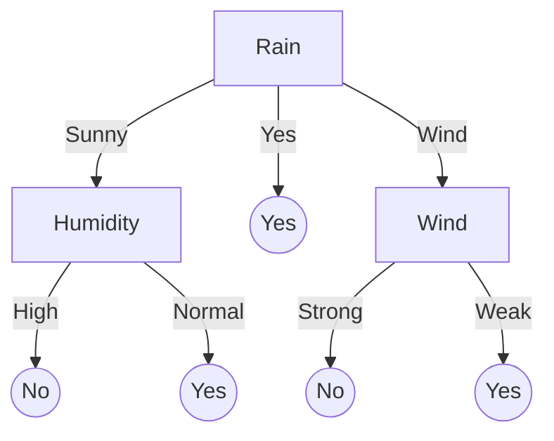

## Lec 6: 非线性学习与集成学习 (Ensemble Methods) 考点
- **决策树 (Decision Tree)**：
    * [ ] **划分标准**：
        * 信息熵 (Entropy)：$H(p) = - \sum p_i \log p_i$。
        * 信息增益 (Information Gain)：父节点熵减去子节点加权熵。
- **集成策略**：
    * [ ] **Bagging (随机森林)**：并行训练，每次从样本中抽取不同的子样本，训练出多个决策树，然后每次分类的时候，将输入输入给多个决策树中，然后将结果汇总，选取最多投票的分类 (Variance)。
    * [ ] **Boosting (AdaBoost)**：
        * 串行训练，关注被前一轮分类错误的样本（提高其权重）。
        * 核心思想：加权组合弱分类器来降低偏差 (Bias)。
- **🚫 明确不考**：
    * [ ] **GBDT (梯度提升树)**：录音明确排除。

## 决策树 (Decision Tree)

### 1. 基本概念
- **结构**：
    - **根节点 (Root Node)**：包含样本全集。
    - **内部节点 (Internal Node)**：对应于一个属性测试。
    - **叶节点 (Leaf Node)**：对应于决策结果（类别）。
- **核心思想**：通过一系列规则对数据进行分类，类似于人类的决策过程（如“如果不下雨且有空，就去打球”）。
- **考点强调**：考试主要考察 **ID3 算法**（仅适用于分类问题）。

### 2. 划分标准 (Splitting Criterion)

#### (1) 信息熵 (Entropy)
熵是度量样本集合纯度最常用的一种指标。熵越小，纯度越高。
对于集合 $D$，假设有 $K$ 个类别，第 $k$ 类样本所占比例为 $p_k$，则 $D$ 的信息熵定义为：
$$ Entropy(D) = - \sum_{k=1}^{K} p_k \log_2 p_k $$

> **计算口诀**：负数 比例 $\log_2$ 比例
> 例如：集合中有 9 个正例，5 个负例。
> $Entropy(D) = - (\frac{9}{14} \log_2 \frac{9}{14} + \frac{5}{14} \log_2 \frac{5}{14}) \approx 0.940$

#### (2) 信息增益 (Information Gain) - ID3 算法
信息增益表示得知属性 $A$ 的信息而使得样本集合 $D$ 的纯度提升（熵减少）的程度。
$$ Gain(D, A) = Entropy(D) - \sum_{v \in Values(A)} \frac{|D_v|}{|D|} Entropy(D_v) $$
其中：
- $Values(A)$ 是属性 $A$ 的所有可能取值。
- $D_v$ 是 $D$ 中在属性 $A$ 上取值为 $v$ 的样本子集。
- 第二项 $\sum \frac{|D_v|}{|D|} Entropy(D_v)$ 是属性 $A$ 对 $D$ 划分后的**条件熵 (Conditional Entropy)**。

**决策规则**：选择**信息增益最大**的属性作为划分属性。

### 3. 经典案例：打网球 (Play Tennis)
根据天气情况决定是否去打网球。
1.  计算根节点的熵。
2.  分别计算 Outlook, Temperature, Humidity, Wind 的信息增益。
3.  发现 **Outlook** 的增益最大，作为根节点。
4.  递归处理子节点。

**最终生成的决策树结构**：

### 4. 考试解题技巧
- **步骤**：
    1.  计算总集合的熵 $Entropy(D)$。
    2.  对于每个属性 $A_i$：
        - 计算每个分支的熵 $Entropy(D_v)$。
        - 计算加权平均熵（条件熵）。
        - 计算增益 $Gain = Entropy(D) - \text{条件熵}$。
    3.  选择 Gain 最大的属性进行分裂。
- **注意**：如果题目要求“目瞪法”或直接画树，可以尝试观察哪一个属性最能把正负样本分开（即某个属性值对应的样本全是正或全是负）。

### 5. 典型例题详解 (Play Tennis)

**题目**：给定以下数据集，请使用 ID3 算法构建决策树的根节点。

| Day | Outlook | Temperature | Humidity | Wind | PlayTennis |
| :--- | :--- | :--- | :--- | :--- | :--- |
| D1 | Sunny | Hot | High | Weak | No |
| D2 | Sunny | Hot | High | Strong | No |
| D3 | Overcast | Hot | High | Weak | Yes |
| D4 | Rain | Mild | High | Weak | Yes |
| D5 | Rain | Cool | Normal | Weak | Yes |
| D6 | Rain | Cool | Normal | Strong | No |
| D7 | Overcast | Cool | Normal | Strong | Yes |
| D8 | Sunny | Mild | High | Weak | No |
| D9 | Sunny | Cool | Normal | Weak | Yes |
| D10 | Rain | Mild | Normal | Weak | Yes |
| D11 | Sunny | Mild | Normal | Strong | Yes |
| D12 | Overcast | Mild | High | Strong | Yes |
| D13 | Overcast | Hot | Normal | Weak | Yes |
| D14 | Rain | Mild | High | Strong | No |

**解题步骤**：

**第一步：计算根节点的熵 (Global Entropy)**
数据集 $D$ 中共有 14 个样本，其中 9 个 Yes，5 个 No。
$$ Entropy(D) = - (\frac{9}{14} \log_2 \frac{9}{14} + \frac{5}{14} \log_2 \frac{5}{14}) = 0.940 $$

**第二步：计算各属性的信息增益**

**1. 属性：Outlook**
- **Sunny** (5个样本): 2 Yes, 3 No
  $Entropy(Sunny) = - (\frac{2}{5} \log_2 \frac{2}{5} + \frac{3}{5} \log_2 \frac{3}{5}) = 0.971$
- **Overcast** (4个样本): 4 Yes, 0 No
  $Entropy(Overcast) = - (\frac{4}{4} \log_2 1 + 0) = 0$
- **Rain** (5个样本): 3 Yes, 2 No
  $Entropy(Rain) = - (\frac{3}{5} \log_2 \frac{3}{5} + \frac{2}{5} \log_2 \frac{2}{5}) = 0.971$

计算 Outlook 的信息增益：
$$ \begin{aligned} Gain(D, Outlook) &= Entropy(D) - [\frac{5}{14} Entropy(Sunny) + \frac{4}{14} Entropy(Overcast) + \frac{5}{14} Entropy(Rain)] \\ &= 0.940 - [\frac{5}{14}(0.971) + \frac{4}{14}(0) + \frac{5}{14}(0.971)] \\ &= 0.940 - 0.693 \\ &= \mathbf{0.247} \end{aligned} $$

**2. 属性：Wind**
- **Weak** (8个样本): 6 Yes, 2 No
  $Entropy(Weak) = - (\frac{6}{8} \log_2 \frac{6}{8} + \frac{2}{8} \log_2 \frac{2}{8}) = 0.811$
- **Strong** (6个样本): 3 Yes, 3 No
  $Entropy(Strong) = - (\frac{3}{6} \log_2 \frac{1}{2} + \frac{3}{6} \log_2 \frac{1}{2}) = 1.000$

计算 Wind 的信息增益：
$$ \begin{aligned} Gain(D, Wind) &= 0.940 - [\frac{8}{14}(0.811) + \frac{6}{14}(1.000)] \\ &= 0.940 - [0.463 + 0.428] \\ &= 0.940 - 0.891 \\ &= \mathbf{0.049} \end{aligned} $$

**3. 属性：Humidity**
- **High** (7个样本): 3 Yes, 4 No $\rightarrow Entropy = 0.985$
- **Normal** (7个样本): 6 Yes, 1 No $\rightarrow Entropy = 0.592$
$$ Gain(D, Humidity) = 0.940 - [\frac{7}{14}(0.985) + \frac{7}{14}(0.592)] = \mathbf{0.151} $$

**4. 属性：Temperature**
(计算过程略，通常增益较低)
$$ Gain(D, Temperature) \approx 0.029 $$

**第三步：选择最佳划分属性**
比较各属性的信息增益：
- Outlook: 0.247 (最大)
- Humidity: 0.151
- Wind: 0.049
- Temperature: 0.029

**结论**：选择 **Outlook** 作为决策树的根节点。

---
**后续步骤（递归）**：
- **Outlook = Overcast** 的分支：熵为 0，直接标记为叶节点 **Yes**。
- **Outlook = Sunny** 的分支：包含 {D1, D2, D8, D9, D11}。
    - 在这个子集中，Humidity 能够完美分开正负样本（High -> No, Normal -> Yes），因此下一个节点选 Humidity。
- **Outlook = Rain** 的分支：包含 {D4, D5, D6, D10, D14}。
    - 在这个子集中，Wind 能够完美分开正负样本（Weak -> Yes, Strong -> No），因此下一个节点选 Wind。

## 集成学习

### Bagging （随机森林）

通过多个简单分类器，并行决策，然后通过投票得到票数最多的分类

### Boosting 
